# Protokoll

Verbatim-nahe Aufzeichnung des aide-knight-Aufbaus pro Phase, als Quelle für die didaktische Destillation in Phase 12 (siehe `knight_plan.md`).

---

## Phase 0 — Tabula rasa & Self-Commitment

### Kontext

Vor Phase 0 lag im Verzeichnis eine vollständige, lauffähige Knight's-Tour-Implementierung (8 Dateien, ~890 Zeilen). Diese wurde **vor Beginn der didaktischen Übung hart entfernt**, damit der Aufbau aus der reinen `knight.md`-Spezifikation heraus tatsächlich bei Null beginnt.

### Aktionen

1. **Sicherung des Alt-Codes** als Git-Tag `pre-rebuild-2026-05-13` — der alte Code bleibt im Git-Objekt-Store auffindbar, falls didaktisch später ein Vergleich gewünscht ist.
2. **Hartes Löschen** der bestehenden Quelldateien (`app.js`, `board.js`, `solver.js`, `ui.js`, `index.html`, `style.css`, `knight_plan.md`) per `git rm`. Im Working-Tree blieb nur `knight.md`.
3. **Self-Commitment des AI-Assistenten:** Während aller folgenden Phasen wird der alte Code **nicht** konsultiert — weder per `Read`, noch per `Bash` (`git show pre-rebuild-2026-05-13:...`), noch über andere Werkzeuge. Diese Selbst-Verpflichtung ist Teil der didaktischen Reinheit: würde im Hintergrund "abgeschrieben", verlöre der Lehrwert seine Substanz.
4. **Master-Plan persistiert** als neuer `aide-knight/knight_plan.md` — der ephemere Plan aus `~/.claude/plans/` wäre für die spätere Phase-12-Destillation nicht verlässlich verfügbar; jetzt ist er versioniert im Repo.

### Commit

`51ee975 — Phase 0: tabula rasa for didactic rebuild`

---

## Phase 1 — 8×8-Brett rendert, Klick erkennbar

### Mikrofragen & Antworten

**Q: Welche Farben für das Schachbrett?**
A: Klassisches Schach-Schema (chess.com / lichess-Defaults): `#f0d9b5` (hell, beige) und `#b58863` (dunkel, braun).

**Q: Schwarzer Text auf dunklen Feldern — kontraststark genug? Und führt eine Mischung "weiß auf dunkel / schwarz auf hell" zu visueller Unruhe?**
A: Ja, Mischung ist unruhig. Empfohlene Lösung: **eine** Tintenfarbe für alles, dunkelbraun `#3a2410` — auf hell hochkontrastiv, auf dunkel noch lesbar. Akzeptiert.

**Q: Wo soll die Klick-Koordinate erscheinen, und wie?**
A: Status-Zeile unter dem Brett. Format: `<col> / <row>` (also `4 / 7`), sehr schlicht. Menü-Elemente kommen später oben.

**Q: Inline (HTML+CSS+JS in einer Datei) oder schon jetzt mehrere Dateien?**
A: Empfehlung: drei getrennte Dateien (`index.html`, `style.css`, `app.js`) ab Anfang — der echte Multi-File-Refactor (board.js / solver.js / ui.js) kommt in Phase 11. Akzeptiert.

### Implementation

- `index.html` — Minimalskelett (`<div id="board">` + `<div id="status">`), kein Framework, kein Build-Schritt.
- `style.css` — CSS-Variablen für Zellgröße (60px) und Farben, CSS-Grid für das Brett, Hover-Effekt per `filter: brightness(1.07)`. Tintenfarbe als `--color-ink`.
- `app.js` — Build-Loop von `row = 7` (oben sichtbar) bis `row = 0` (unten), um die Schach-Konvention `a1 = (0,0)` einzuhalten. Feldfarbe folgt `(row + col) % 2 === 0 → dark` (macht `a1` zu einem dunklen Feld, regelkonform).

### User-Test

Doppelklick auf `index.html` öffnet das Brett im Browser. Klick auf ein Feld zeigt unten `<col> / <row>`. User-Bestätigung per Screenshot:

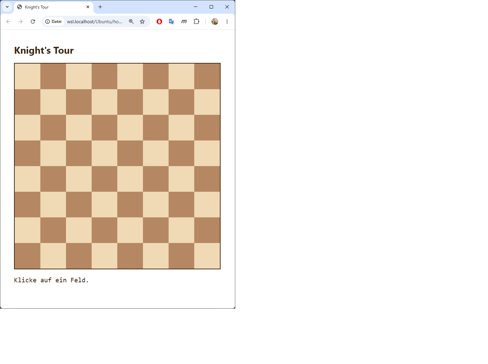

### Commit

`dbe9358 — Phase 1: 8x8 chessboard renders, click reports cell coordinates`

---

## Phase 2 — Solver-Kern (DFS + Warnsdorff), Linie + Nummern

### Mikrofragen & Antworten (vorab)

**Q: Welche Farbe für die Tour-Linie?**
A: Kräftiges Rot `#c0392b`. Kontrastiert gut auf beigem und braunem Feld.

**Q: Wo soll der Schritt-Zähler erscheinen, und in welcher Wortwahl?**
A: Zweite Status-Zeile unter dem Brett, Wortlaut `Lösung nach N Schritten.` bzw. `Keine Lösung nach N Schritten.` — User-Diktion: "Schritte", nicht "Zugversuche" (obwohl knight.md letzteren Begriff verwendet).

### Mikrofragen & Antworten (während der Implementierung)

**Q (vom User mid-phase): Soll das UI komplett auf Englisch sein, mit Vorbereitung für weitere Sprachen?**
A: Ja. Eingebaut: `STRINGS`-Objekt mit Spracheinträgen (`en` als aktiv, `de` mitgepflegt) und `LANG`-Konstante am Kopf von `app.js`. Neue Sprache hinzufügen = ein weiterer Eintrag im Objekt.

**Q (vom User mid-phase): Können die Tour-Nummern nicht oberhalb der roten Linie liegen statt darunter?**
A: Ja. Z-Index-Layering: Felder unten, Linie (`#overlay`) `z-index: 1`, Nummern (`.num`) `z-index: 2`. Stacking-Kontext wird über `#board { z-index: 0 }` erzwungen, damit die Reihenfolge nicht aus dem äußeren Kontext gestört werden kann.

**Q (vom User mid-phase): Sollte ich nicht schon jetzt zwischen DFS und Warnsdorff wählen können?**
A: Begriffsklärung erforderlich. DFS ist *der* Suchalgorithmus, Warnsdorff eine Heuristik *innerhalb* des DFS für die Reihenfolge der Kandidaten. `knight.md` (Z. 30) sieht drei Heuristik-*Optionen* vor (Warnsdorff / Brute Force / Outside-In), alle auf DFS-Basis. Entscheidung: bei Plan bleiben — Heuristik-Auswahl kommt in **Phase 4**, Phase 2 fährt mit Warnsdorff fest verdrahtet.

### Implementation

- **Solver** (iterativ, Stack-basiert):
  - `visited` als `Int32Array(W*H)` — 0 = unbesucht, sonst Tour-Nummer. Cache-freundlich, vorbereitet für große Bretter.
  - Pro Stack-Frame: bereits Warnsdorff-sortierte Kandidatenliste + Cursor. Auf Backtrack: Frame poppen, `visited` und `path` zurücksetzen.
  - **Schritt-Counter:** jeder Forward-Versuch UND jeder Backtrack zählen je +1.
- **Render** (im selben `app.js`, Multi-File kommt in Phase 11):
  - SVG-Overlay als Kind von `#board`, `viewBox="0 0 8 8"` (eine Einheit pro Zelle, automatisch skalierend).
  - Tour-Pfad als einzelne `<polyline>`, `stroke="#c0392b"`, `stroke-width="0.08"` (≈ 4.8 px bei 60-px-Zellen).
  - Y-Achse gespiegelt für die SVG-Koordinaten, weil row=0 logisch unten, SVG-Y aber von oben zählt: `y = BOARD_SIZE - 1 - row + 0.5`.
  - Nummern als `<div class="num">N</div>` in der jeweiligen Zelle, font-size proportional zur Zellgröße (CSS-Variable).
  - Bei jedem neuen Klick: alle alten Nummern entfernen, SVG leeren.
- **i18n-Scaffold:** `STRINGS = { en: {...}, de: {...} }`, `LANG = 'en'`, alle UI-Strings über das `T`-Alias. `<html lang>`, `document.title`, h1 und Status-Zeilen werden zur Laufzeit gesetzt.

### User-Test

8×8-Klick auf beliebiges Feld liefert in unter 100 ms eine vollständige Tour. Die ersten Sprünge prüfen sich visuell als gültige `(±1, ±2)`-Bewegungen. UI komplett auf Englisch. Layer-Reihenfolge sichtbar: Linie unter den Nummern.

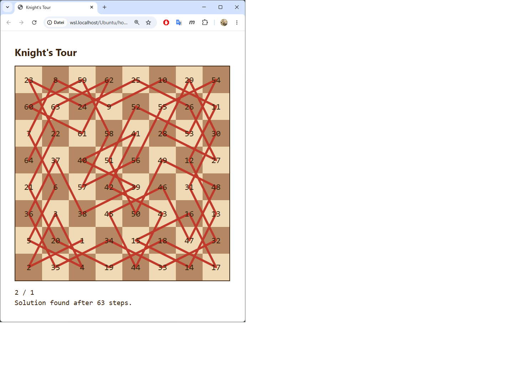

### Commit

`1d9f19c — Phase 2: knight's tour solver core (iterative DFS + Warnsdorff) with line and number render`

---

## Phase 3 — Variable Brettmaße, dynamisches Padding, Performance-Fundament

### Mikrofragen & Antworten

**Q: Wieviel Padding um das Brett (ersetzt den Bounds-Check im Solver)?**
A: Dynamisch pro Figur — beim Solver-Start aus der aktiven Move-Liste berechnet: `pad = max(|dx|, |dy|)`. Für den Springer ergibt das 2; für die in `knight.md` Zeile 33 genannten zukünftigen Figuren (1,4)/(2,3)/(3,4) entsprechend 4, 3, 4. Cleanere Abstraktion als ein hartcodierter Wert; trägt automatisch durch alle späteren Phasen.

**Q: Maximale Brettgröße?**
A: Kein Cap. Der User darf eintragen, was er will — auch Werte, bei denen der Browser ins Schwitzen kommt. Phase 9 bringt mit dem 5-Sekunden-`confirm()` einen Abbruch-Mechanismus für lange Läufe.

**Q: Wie soll das W/H-Eingabe-UI sich verhalten?**
A: Zwei Number-Inputs oben über dem Brett, Auto-Apply auf `blur` oder Enter. Minimal-UI, kein extra Apply-Button.

### Implementation

- **`buildBoard()`** ersetzt den früheren Top-Level-Build-Loop. Wird beim Start und bei jeder Dimensionsänderung neu aufgerufen.
  - Berechnet die Zellgröße `cellPx = clamp(2, min(viewport / W, viewport / H), 60)` — passt sich an die Viewport-Größe an, damit auch 200×100 ohne Scrollen sichtbar bleibt.
  - Grid-Spaltenanzahl, Brettgröße, Zellgröße werden inline auf `boardEl.style` gesetzt — `repeat(var(--...), ...)` wäre eleganter, aber Browser-Support für `var()` als Repeat-Count ist uneinheitlich.
- **Padding-Solver:** `visited` ist jetzt `Int32Array((W+2·pad) · (H+2·pad))`. Padding-Felder werden vor dem DFS auf `-1` gesetzt; die Kandidaten-Schleife schaut nur noch auf `visited === 0` und fängt damit gleichzeitig Out-of-Bounds und bereits besuchte Felder ab — eine Verzweigung pro Move-Test weniger.
- **State-Refactor:** `BOARD_SIZE` ist weg. `W`, `H`, `cellByIdx`, `overlay` sind nun `let`-Variablen auf Modul-Ebene, von `buildBoard()` neu gesetzt. Multi-File-OO-Refactor kommt erst in Phase 11 — bewusst nicht jetzt.

### Smoke-Tests (Solver-Kern, Node-Standalone)

| Brett | Startfeld | Schritte | Zeit |
|---|---|---|---|
| 8×8 | (0,0) | 63 | 2 ms |
| 8×8 | (3,3) | 63 | 10 ms |
| 5×5 | (0,0) dunkel | 24 | 1 ms |
| 5×5 | (2,2) dunkel | 24 | 0 ms |
| 100×200 | (0,0) | 19 999 | 101 ms |
| 100×200 | (50,100) | 19 999 | 53 ms |

100×200 löst weit unter der "einstellige Sekunden"-Akzeptanzschwelle.

### User-Test (Browser) — zwei lehrreiche Befunde

**1) 200×100 — der erwartete Stresstest.**

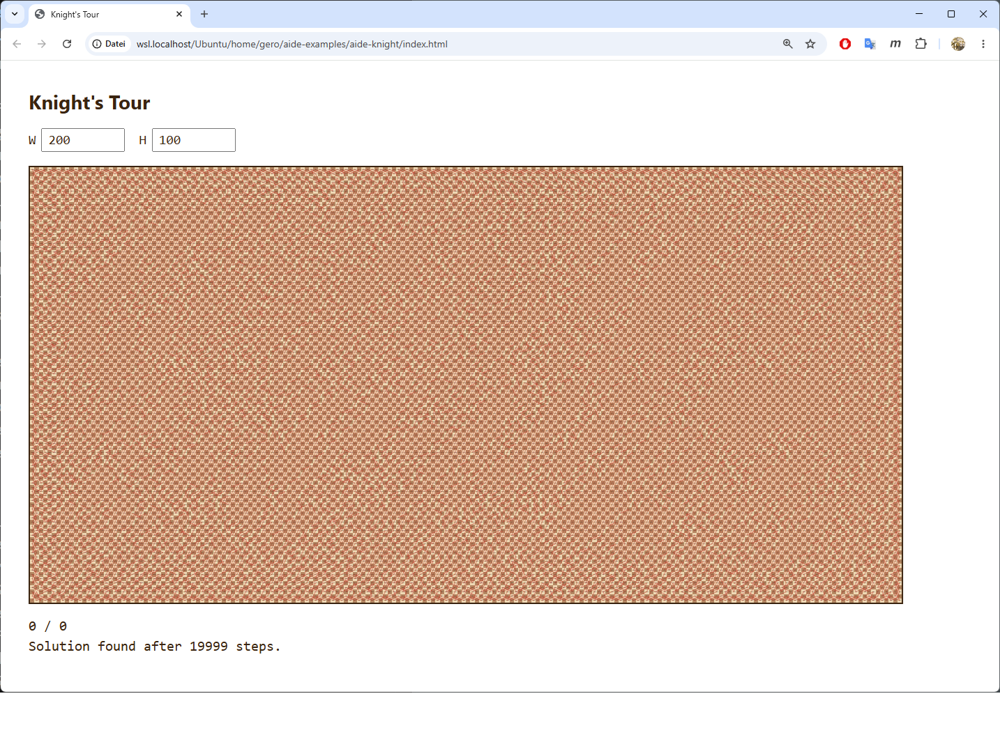

`Solution found after 19999 steps.` Das sind `W·H − 1` Schritte und **0 Backtracks** — Warnsdorff "läuft hier durch", ohne ein einziges Mal in eine Sackgasse zu geraten. Die roten Tour-Linien überlagern sich so dicht, dass kaum ein einzelner Sprung sichtbar bleibt — das Brett wirkt fast einfarbig. Für große, breite Bretter ist Warnsdorff praktisch perfekt.

**2) 8×4 — der überraschende Pathologie-Fall.**

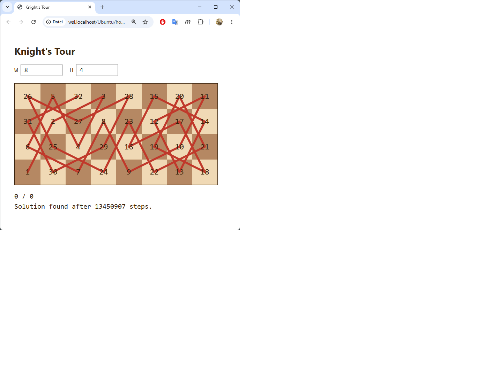

`Solution found after 13450907 steps.` Bei nur 32 Feldern. Das DFS hat 13.45 Millionen Versuche gebraucht — davon ≈ 6.7 Millionen Backtracks (jeder Backtrack zählt als 1, jeder Vorwärtszug als 1).

**Warum?** Reine Warnsdorff-Heuristik ist auf schmalen Rechteck-Brettern bekannt-unzuverlässig. Bei Gleichstand des Onward-Count entscheidet die Move-Definitionsreihenfolge willkürlich, und auf 8×4 führt diese willkürliche Wahl die Suche in eine Sackgassen-Region — DFS rettet das Ergebnis am Ende, aber mühsam.

Standard-Fix in der Literatur (Pohl 1967, später Roth, Squirrel/Cull): **Tie-Breaker-Regel** bei gleichem Onward-Count, z. B. das Feld bevorzugen, das näher an einer Brett-Ecke liegt. Das ist hier *nicht* eingebaut und gehört auch nicht in Phase 3. Phase 4 wird zusätzliche Heuristiken (Outside-In, Brute Force) und einen Mix-Button bringen — ggf. wäre danach der richtige Zeitpunkt für einen Warnsdorff-Tie-Breaker als bewusste Phase.

**3) 5×5 — die Paritäts-Beobachtung des Users.**

Auf 5×5 existiert eine offene Springertour nur, wenn das **Startfeld dunkel** ist. Reine Färbungs-Mathematik:

- 5×5 = 25 Felder, davon 13 dunkel (Konvention `(row+col)%2===0`) und 12 hell.
- Ein Springerzug wechselt immer die Feldfarbe → Tour der Länge 25 alterniert `Start-Farbe, andere, Start-Farbe, …` = 13 × Start-Farbe + 12 × andere.
- Start = hell ⇒ 13 helle Felder nötig, aber es gibt nur 12 ⇒ unmöglich.

Damit hat das `5×5 verweigert sinnvoll`-Akzeptanzkriterium aus dem Master-Plan ein konkretes, mathematisch sauberes Beispiel: Klick auf z. B. `(0,1)` (hell) liefert eine echte "No solution found"-Antwort. Schöne Mini-Anekdote für Phase 12.

### Commit

`fe74bf2 — Phase 3: variable W*H boards, padded solver, dynamic cell size`

### Nachzügler: Resize-Listener (didaktisch relevant!)

User-Hinweis direkt nach Phase-3-Akzeptanz:

> "Das Board muss auf einen window resize event reagieren und sich anpassen, auch wenn keine zusätzliche User-Interaktion erfolgt. Wenn wir auf einem Android-Device sind und das Gerät von Portrait nach Landscape drehen, muss es auch klappen … ist da meine Erwartung zu hoch?"

**Technische Korrektur:** `applyCellSize()` ist als Pure-CSS-Resize-Pfad aus `buildBoard()` herausgezogen — verändert nur `--board-cell` und die inline Grid-Geometrie auf `boardEl.style`, keine DOM-Rekonstruktion. Resize-Listener auf `window` mit Trailing-Edge-Debounce (80 ms). Die gerenderte Tour bleibt erhalten: SVG-Overlay skaliert über seine `viewBox`, Schriftgrößen folgen der CSS-Variable.

**Meta-Erkenntnis (wichtiger als die Code-Korrektur):** Die Erwartung des Users war nicht zu hoch. Resize-Reaktion gehört bei einer Webapp, deren ganzer Sinn aus der visuellen Darstellung kommt, zum **Baseline-Verhalten** — wie Hover-States, sensible Defaults, Keyboard-Bedienbarkeit. YAGNI-Disziplin gegen Featuritis darf das nicht aushebeln; "der Plan erwähnt es nicht" ist kein Argument, sondern eine Lücke im Plan.

Diese Erkenntnis ist als neue Sektion **"Baseline-Verhalten ist kein Feature"** in `~/.claude/CLAUDE.md` verankert, damit sie auch zukünftige Projekte prägt. Konkretes Anti-Pattern, das ich hier zeige: Plan-Wortlaut zu eng auslegen ("dynamische Canvas-Größe" auf "passt sich an W/H an" reduzieren, statt auch "passt sich an Viewport-Änderungen an" mitzudenken).

Sehr relevanter Punkt für die Phase-12-Lehrunterlage unter "Was Profis anders machen" — gerade weil hier der **User** den Profistandard setzt und die AI das nachholt.

### Nachzügler-Commit

`94e018d — Phase 3 follow-up: window resize listener, preserves rendered tour`

---

## Phase 4 — Heuristik-Wahl, Figuren, Mix-Button, Persistenz

### Mikrofragen & Antworten (vorab)

**Q: Wo sollen die drei neuen Controls (Heuristik-Dropdown, Figur-Dropdown, Mix-Button) sitzen?**
A: Eigene Reihe unter W/H. Klar gegliedert, keine Platzprobleme auf schmalen Screens (mit `flex-wrap`).

**Q: Was passiert beim Klick auf den Mix-Button?**
A: Reihenfolge neu permutiert + automatisch erneuter Solve vom letzten Startfeld. User sieht den Effekt sofort. Falls noch kein Startfeld geklickt wurde: nur würfeln, kein Solve.

**Q: Was soll über Reloads hinweg in localStorage überleben?**
A: Vollständiger State — W, H, Heuristik, Figur und Mix-Order. Beim Reload Settings wiederhergestellt; Tour selbst wird nicht persistiert (nur Konfiguration).

### Mikrofragen & Antworten (während der Implementierung)

**Q (vom User mid-phase): Beim Klick auf ein Feld erscheint die Koordinate nicht sofort in der Fußleiste — als visuelle Rückmeldung wäre das aber nötig, bevor die Suche beginnt.**
A: Bug bestätigt. Ursache: JS ist single-threaded — der Click-Handler setzt `statusEl.textContent = "X / Y"`, ruft dann aber synchron `solve()` auf, das den Main-Thread blockiert; der Browser kommt vor dem Block nicht zum Repaint. Bei 8×8 Knight (1 ms) sieht man's nicht, bei längeren Suchen schon. **Fix:** Double-`requestAnimationFrame` zwischen Statusupdate und `solve()`. Eine einzelne rAF läuft *vor* dem nächsten Paint; zwei rAFs hintereinander garantieren, dass der Browser dazwischen einen Paint einlegt. `setTimeout(fn,0)` würde es auch tun, ist aber per globaler CLAUDE.md-Regel verpönt — `requestAnimationFrame` ist der saubere Weg.

**Q (vom User mid-phase): In der Spec gibt es das Feature, dass Re-Klick auf dasselbe Startfeld die Suche von der aktuellen Lösung aus fortsetzt. Gehört das zu dieser Phase?**
A: Nein — gehört zu **Phase 9** zusammen mit dem 5-Sekunden-Confirm-Dialog. Begründung: die "Continue from current solution"-Logik braucht eine speicherbare Search-State-Struktur (Stack + visited), die in Phase 9 sowieso aufgebaut werden muss, damit der Cancel-Dialog dazwischenfunken kann.

### Implementation

- **Heuristiken** als String-Konstanten (`'warnsdorff'`, `'outsideIn'`, `'bruteForce'`), zentral in `pickCandidates()` ausgewertet:
  - Warnsdorff: Onward-Count pro Kandidat, aufsteigend.
  - Outside-In: euklidischer Quadrat-Abstand zum Brett-Zentrum, *negiert* (damit "größer = weiter draußen = bevorzugt" mit derselben aufsteigenden Sort-Funktion klappt).
  - Brute Force: keine Sortierung, Reihenfolge = aktuelle Move-Definitionsreihenfolge.
  - Für alle drei: stabile Sortierung (ES2019+) hält bei Gleichstand die aktuelle Move-Order — der Mix-Button hat damit auch für Warnsdorff/Outside-In als Tie-Breaker einen sichtbaren Effekt.
- **Figuren** als `"a,b"`-Keys (`'1,2'` Knight, `'1,4'` Camel, `'2,3'` Zebra, `'3,4'` Giraffe). `generateBaseMoves(figureKey)` erzeugt acht Move-Vektoren als sign+swap-Permutationen von (a, b).
- **Mix-Button:** Fisher-Yates auf der aktiven Move-Liste, Tooltip via `mixBtn.title` zeigt die aktuelle Reihenfolge als `(dx,dy)`-Paare. Auto-Resolve vom letzten Startfeld via `resolveLast()`.
- **State + localStorage:** Modul-globale `let`-Variablen für `W`, `H`, `heuristic`, `figure`, `activeMoves`. `saveState()` schreibt nach jedem Setting-Change. `loadState()` validiert beim Reload (`isValidMoveOrder` prüft, dass die gespeicherte Order eine Permutation der Basis-Moves ist) und fällt sonst auf Defaults zurück. Storage-Key: `aide-knight-state-v1` — das `v1` lässt Schema-Migrationen später zu.
- **i18n** erweitert um `heuristicLabel`, `figureLabel`, `mixBtn` (für `en` und `de`).

### Smoke-Tests (Node-Standalone, Step-Budget 50 M)

| Config | Schritte | Zeit | Bemerkung |
|---|---|---|---|
| 8×8 (1,2) Warnsdorff | 63 | 1 ms | Sauber durch (Regression-Check) |
| 8×8 (1,2) Outside-In | 113 | 1 ms | ~50 Backtracks, andere Geometrie |
| 8×8 (1,2) Brute Force | 16 501 401 | 1 028 ms | Bekannte Schwere |
| 8×8 (1,4) Camel Warnsdorff | >50 M | abgebrochen | Vermutlich keine Hamilton-Tour |
| 8×8 (1,4) Camel Outside-In | >50 M | abgebrochen | Dito |
| 8×8 (2,3) Zebra Warnsdorff | >50 M | abgebrochen | Dito |
| 8×8 (3,4) Giraffe Warnsdorff | 3 420 213 | 303 ms | Sauber "no solution" |
| 10×10 (1,2) Warnsdorff | 99 | 0 ms | Sauber |
| 10×10 (1,2) Outside-In | 13 973 | 1 ms | Outside-In braucht hier deutlich mehr Backtracking |

Bemerkenswert: Outside-In auf 10×10 produziert 13 973 Schritte vs. 99 für Warnsdorff — dramatischer Heuristik-Unterschied. Und die größeren Figuren (Camel, Zebra) haben auf 8×8 vermutlich gar keine Hamilton-Tour; die Giraffe beweist's binnen 300 ms.

### User-Test

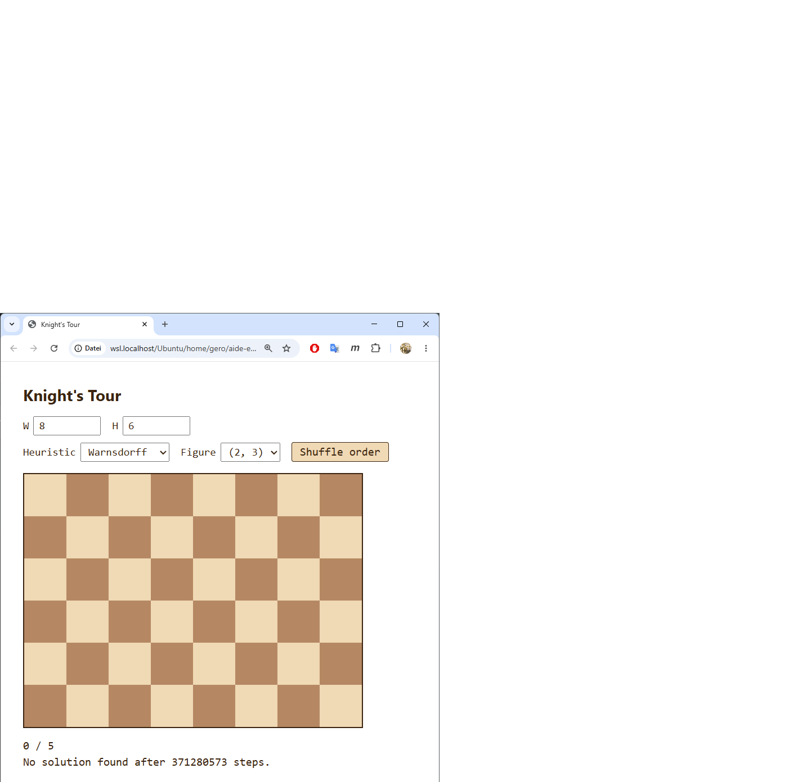

User hat den schwersten denkbaren Fall ausgewählt: **8×6 Brett, Figur (2,3) Zebra, Heuristik Warnsdorff, Startfeld (0,5)**. Ergebnis nach ≈70 Sekunden Browser-Pause: `No solution found after 371280573 steps.` — der Solver hat den kompletten Suchbaum erschöpft und damit *bewiesen*, dass auf 8×6 keine offene Zebra-Tour von (0,5) existiert. Genau das gewünschte Verhalten: keine willkürliche Abbruchgrenze, sondern echtes Erschöpfen des Suchraums. Phase 9 wird mit dem 5-Sekunden-Confirm-Dialog die Geduldsanforderung an den User entschärfen.

Bestätigt funktionierende Features:
- Heuristik-Umschaltung mit Auto-Resolve vom letzten Startfeld
- Figur-Wechsel mit Brett-Reset und passendem Padding (für (2,3) wird `pad=3` gerechnet)
- Mix-Button mit Tooltip-Anzeige der aktuellen Reihenfolge
- Status-Feedback-Fix (Koordinate erscheint sofort, bevor der Solver blockiert)
- localStorage-Persistenz über Reload hinweg

### Commit

`bec8718 — Phase 4: heuristic + figure + mix-button + full-state localStorage`

---

## Phase 5 — Sichtbarkeits-Toggles

### Mikrofragen & Antworten

**Q: Wo sollen die beiden Checkboxen sitzen?**
A: Eigene dritte Reihe — Reihe 1 W/H, Reihe 2 Heuristik/Figur/Mix, Reihe 3 Numbers/Lines. Klar gegliedert.

**Q: Sollen Nummern automatisch unsichtbar werden, wenn die Schrift sowieso unlesbar wäre?**
A: Ja, dynamisch nach Lesbarkeit — Schwelle bei Font ≥ 9 px (entspricht Zellgröße ≥ 28 px, weil Font = 0.32 · Zellgröße). Die Checkbox bleibt aktiv, nur der Render wird unterdrückt.

### Implementation

- **CSS-Custom-Properties als Toggle-Mechanismus:** `--num-display` und `--overlay-display` steuern `display:` der entsprechenden Elemente. Flippen einer Checkbox schreibt nur die CSS-Variable um — kein DOM-Eingriff, gerenderte Tour bleibt unangetastet.
- **Auto-Hide-Logik** in `applyVisibility()` — wird aus `applyCellSize()` mitaufgerufen, damit beim Resize die Schwelle automatisch nachgezogen wird:
  ```js
  const numbersUsable = showNumbers && (currentCellPx * 0.32) >= NUM_FONT_MIN_PX;
  ```
  Wenn der User das Fenster verkleinert und die Zellgröße unter 28 px fällt: Nummern verschwinden, Checkbox bleibt aktiv.
- **Persistenz:** `showNumbers` und `showLines` werden mit dem übrigen State in `localStorage` gespeichert.
- **i18n:** zwei neue Strings (`numbersLabel`, `linesLabel`), in `en` und `de` mitgepflegt.

### User-Test

**Test 1 — Lines-only auf 7×7 Knight (Warnsdorff):**

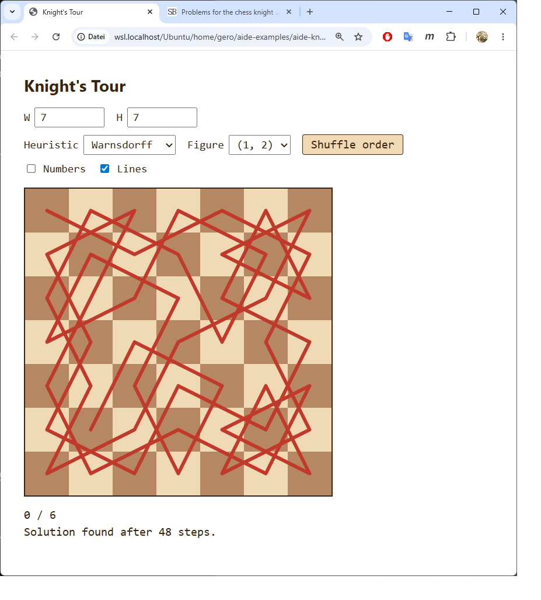

Bei deaktivierter "Numbers"-Checkbox erscheint die Tour ausschließlich als rote Liniengeometrie. Lehrreich für die visuelle Symmetriebetrachtung: jeder Schnittpunkt erzählt etwas über die Springer-Bewegungsstruktur.

**Test 2 — Numbers-only auf 40×25 Knight (Warnsdorff):**

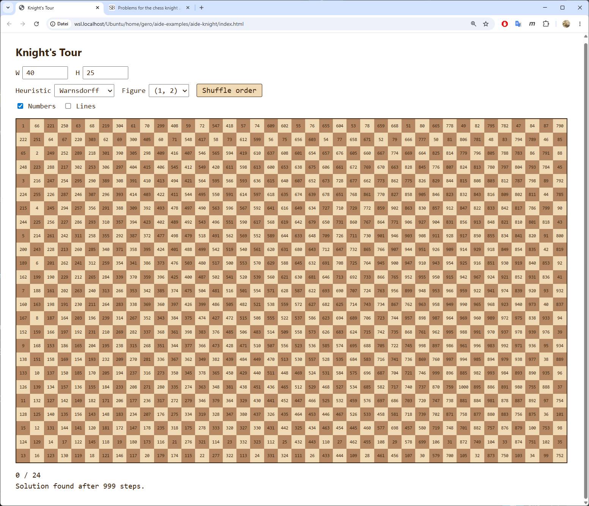

Brett knapp am Render-Limit: 40 × 25 = 1000 Felder, Zellgröße ≈ 30 px (begrenzt durch Viewport-Höhe), Font ≈ 9.6 px — gerade noch über der 9-px-Schwelle, Nummern werden also gerendert und sind klein-aber-lesbar. Würde der User auf 41×25 erhöhen, fiele die Schrift unter 9 px und die Nummern würden auto-hidden, ohne dass er die Checkbox ändert. Sauberes Beispiel für die dynamische Schwelle.

Zugzähler 999 von 1000 — Warnsdorff durch, 0 Backtracks.

### Commit

`72f15cd — Phase 5: visibility toggles for numbers and tour line`

---

## Phase 6 — Geschlossene Touren

### Mikrofragen & Antworten (vorab)

**Q: Wo soll die "Closed"-Checkbox sitzen?**
A: An Reihe 3 angehängt — neben Numbers und Lines.

**Q: Wie soll die Schließungslinie sich von der normalen Tour-Linie unterscheiden?**
A: Gestrichelt, gleiche Farbe (rot). Klares Signal "gleicher Tour-Bestandteil, sondiert die Schließung".

### Mikrofragen & Antworten (während der Implementierung — wichtig!)

**Q (vom User mid-phase, kurz nach Start der Implementierung): Noch eine Idee für die geschlossene Tour: wenn man im Startfeld beginnt, dann müsste das *andere* Feld, von dem aus das Startfeld erreichbar ist, so lange wie möglich nicht benutzt werden. Künstlich verschlechterte "hohe Freiheitsgrade"-Zahl, oder algorithmisches Aussparen bis zum vorletzten Zug.**

**A: Das ist *exakt* die klassische Schwenk-Technik in praktischer Form — und didaktisch der wertvollste Moment der bisherigen Übung.** Statt des in `knight.md` Zeile 21 skizzierten Beide-Enden-Verfahrens (alternating ends) liefert die Bias-Idee dasselbe Ziel mit dramatisch weniger Code:

- Vor der Suche: Maske der Startnachbarn berechnen (Felder, von denen aus der Springer das Startfeld erreichen kann).
- In Warnsdorff/Outside-In: diesen Startnachbarn einen Strafwert von 1000 auf den Onward-Count addieren (alle realen Counts ≤ 8) — Stable-Sort schiebt sie ans Ende.
- Bei Path-Vollständigkeit: prüfen, ob der letzte Pfad-Eintrag in der Startnachbar-Maske liegt. Wenn ja, geschlossen, fertig. Wenn nein, Backtrack via normaler exhausted-path Logik.

**Vorteile gegenüber Alternating-Ends:**
- Eindimensional, kein Deque, ein Pfad-Array
- Code-Erweiterung: ~10 Zeilen statt ~80
- Bei Warnsdorff/Outside-In hocheffektiv (Smoke-Tests unten)

Für Brute Force greift der Bias nicht (kein Scoring) — der Solver verlässt sich dort allein auf das Schließungs-Backtracking, ist also langsam wie offene Brute-Force, aber korrekt.

Das ist ein lehrreicher Moment für Phase 12: **der User hat den Algorithmus verbessert**. Nicht der AI-Assistent. Das Beide-Enden-Verfahren war ein plausibler, aber unnötig schwerer Vorschlag in der Spec; im Live-Dialog kam der User auf die elegantere Variante und hat damit auch demonstriert, dass die in `knight.md` notierten Ideen nicht heilig sind.

### Implementation

- **State:** `wantClosed: boolean`, persistiert in `localStorage`.
- **Solver:** `solve(startCol, startRow, closed)` — der `closed`-Parameter aktiviert die Bias-Logik.
  - `startNbrs: Uint8Array` markiert Startnachbar-Felder vor dem DFS.
  - `pickCandidates` addiert `CLOSURE_PENALTY = 1000` auf Startnachbar-Scores (für Warnsdorff und Outside-In; für Brute Force kein Bias).
  - Auf `path.length === total`: Wenn `closed`, zusätzlich prüfen ob `startNbrs[at(last)]`; nur dann Erfolg. Sonst fällt der Loop durch zum normalen Backtrack-Pfad (top frame ist leer, weil alle Felder besucht).
- **Rendering:** `renderTour(path, isClosed)` — bei `isClosed` zusätzlich ein `<line>` von `path[N-1]` zu `path[0]` als Dashed-Stroke (`stroke-dasharray='0.18 0.12'`). Liegt im selben `#overlay`, wird also vom Lines-Checkbox-Toggle automatisch mitversteckt.
- **i18n:** neuer String `closedLabel` (en: "Closed", de: "Geschlossen").

### Smoke-Tests (Node-Standalone)

| Konfig | Schritte | Zeit | Bemerkung |
|---|---|---|---|
| 8×8 Knight (0,0) Warnsdorff CLOSED | 85 | 1 ms | 22 Backtracks — Bias greift, geschlossene Tour |
| 8×8 Knight (3,3) Warnsdorff CLOSED | 63 | 8 ms | **0 Backtracks** — gerader Lauf direkt zur geschlossenen Tour |
| 6×6 Knight (0,0) Warnsdorff CLOSED | 35 | 0 ms | 0 Backtracks |
| 10×10 Knight (0,0) Warnsdorff CLOSED | 99 | 0 ms | 0 Backtracks |
| 5×5 Knight (0,0) Warnsdorff CLOSED | 3 470 157 | 425 ms | Beweist exhaustiv: keine geschlossene Tour |
| 5×5 Knight (2,2) Warnsdorff CLOSED | 1 283 153 | 146 ms | Dito, vom Zentrum |
| 8×8 Knight (0,0) Outside-In CLOSED | 77 | 1 ms | Auch mit anderer Heuristik effektiv |
| 8×8 Knight (0,0) Warnsdorff OPEN | 63 | 0 ms | Regression-Check: Open-Mode unverändert |

Der Bias kostet auf lösbaren Konfigurationen typischerweise 10-40 % zusätzliche Schritte gegenüber Open-Mode. Auf nicht-lösbaren beweist die Suche die Nicht-Existenz in unter einer Sekunde (5×5).

**Mathematischer Hintergrund 5×5 nicht-geschlossen:** Auf 5×5 hat das Brett 13 dunkle + 12 helle Felder. Eine geschlossene Tour müsste Länge 25 sein, dabei abwechselnd Farben besuchen, *und* zum Startfeld zurückkehren. Aus dem Startfeld der Farbe X folgt: 13 × X + 12 × ¬X, der letzte Zug (Zug Nr. 25, Farbe X) müsste sich aber mit dem ersten Zug (Farbe X) per Springerzug verbinden — Springerzug wechselt aber die Farbe. Widerspruch. Keine 5×5-Tour ist geschlossen.

### User-Test

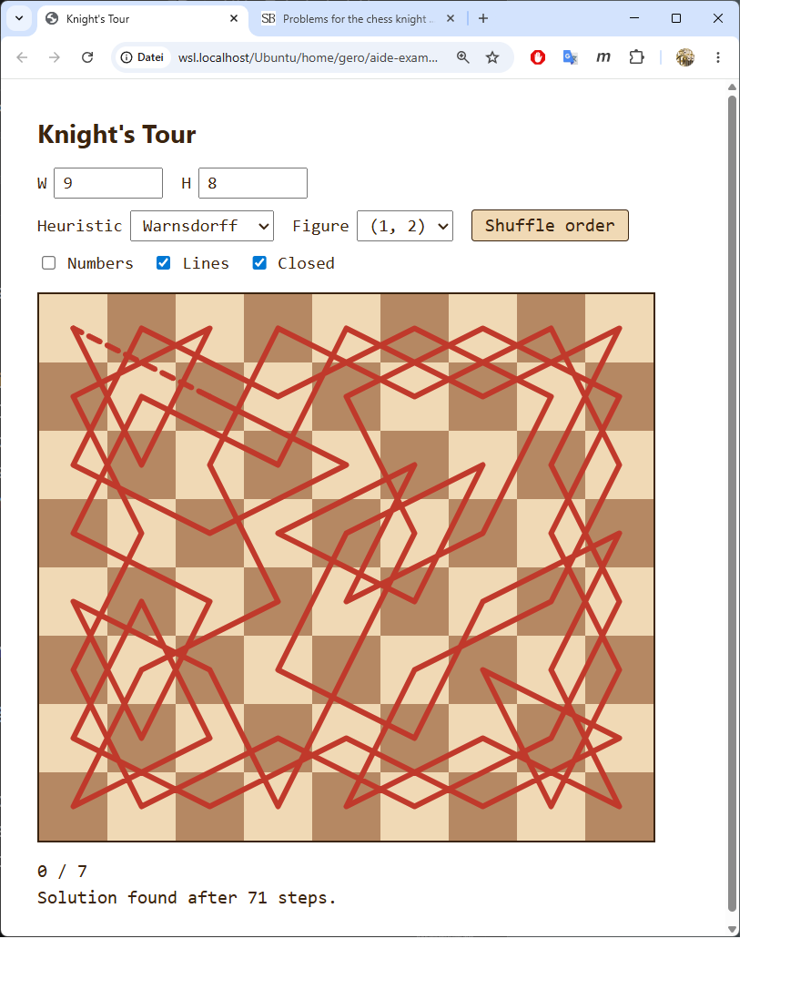

Test: **9×8 Brett, Knight, Warnsdorff, Closed-Modus, Start (0,7)**. Lines an, Numbers aus (Geometrie-Sicht). Solver liefert in 71 Schritten eine geschlossene Tour über alle 72 Felder. Die gestrichelte rote Schließungslinie ist oben links sichtbar — verbindet das letzte Tour-Feld mit dem Startfeld.

Bestätigt funktionierende Features:
- Closed-Checkbox in Reihe 3 zwischen Lines und (nichts) — siehe Header
- Solver mit Bias findet geschlossene Touren mit minimaler Mehrarbeit
- Schließungslinie visuell deutlich (gestrichelt) von der Tour-Linie unterscheidbar
- Lines-Toggle versteckt auch die Schließungslinie (gemeinsamer `#overlay`)
- localStorage-Persistenz der Closed-Flag

### Commit

`8025365 — Phase 6: closed-tour mode via start-neighbour bias (Schwenk technique)`

---

## Phase 7 — Symmetrien (axisV / point / rot90)

### Vorabklärung des Scopes

`knight.md` Zeile 24 fordert nur **Rotationssymmetrie**. Der Master-Plan-Eintrag generalisiert auf axisV + point + rot90 — das geht über `knight.md` hinaus. Nach Rückfrage opt-in-Entscheidung: alle drei Typen mitnehmen.

### Mikrofragen & Antworten

**Q: Wo soll die Symmetrie-Kontrolle sitzen?** A: An Reihe 3 anhängen (neben Numbers/Lines/Closed).

**Q: Was tun, wenn das Brett zur gewählten Symmetrie nicht passt?** A: Checkbox-Optionen einzeln auto-disablen. Klare UI-Semantik, keine versteckten Fallbacks.

### Algorithmus: Shift-by-Quarter

Statt eine Tour zu suchen und nachträglich auf Symmetrie zu prüfen, baut der Solver eine **Quarter-Path** der Länge `q = total / orbitSize` (2 für axisV/point, 4 für rot90) auf. Beim Platzieren einer Quarter-Zelle werden die Orbit-Mates implizit mitbesucht. Die *volle* Tour wird beim Rendern aus dem Quarter durch wiederholte Anwendung der Symmetrie-Transformation erzeugt:

```
axisV/point: full = quarter ++ transform(quarter)
rot90:       full = quarter ++ rot90(quarter) ++ rot180(quarter) ++ rot270(quarter)
```

**Bridge-Constraint:** Der Übergang vom Ende des Quarter zum Anfang des nächsten Quarter im vollen Tour muss ein gültiger Figurenzug sein. Konkret: `path[q-1]` muss ein Springer-Nachbar von `symTransform(path[0])` sein. Das ist die **einzige zu prüfende Bridge** — alle weiteren Quarter-Übergänge folgen aus Rotations-/Spiegelungs-Invarianz der Move-Menge.

**Closure-Bias erweitert:** Die Phase-6-Bias-Technik aus Schwenk's Toolkit muss angepasst werden. Naive Übertragung — "Knight-Neighbors von Bridge mit Penalty" — funktioniert nicht, weil das Platzieren einer Zelle `(c,r)` über die Orbit-Symmetrie auch `transform(c,r)` belegt. Wenn `transform(c,r)` ein Bridge-Neighbor ist, wäre dieser Closure-Kandidat damit unwiederbringlich verbraucht. **Fix:** Die Bias-Menge umfasst Bridge-Neighbors **und ihre Orbit-Mates**. Der Check bei `path.length === q` bleibt auf die Original-Bridge-Neighbors beschränkt (nur ein expliziter Closure-Treffer zählt).

### Mathematische Restriktion: Farbparität

Beim Implementieren stellte sich heraus, dass die Shift-by-Quarter-Struktur nicht für alle Brett-Konfigurationen Lösungen findet — selbst dort, wo Touren der genannten Symmetrie nachweislich existieren. **Grund:** der Bridge-Zug muss farbflippend sein (Springer-Eigenschaft), die Farbe von `path[q-1]` aber alterniert sich aus `path[0].color` plus q-1 Schritten, während die Farbe von `symTransform(path[0])` von der Transformation selbst abhängt:

| Symmetrie | Farb-Effekt der Transformation | Bridge funktioniert wenn |
|---|---|---|
| axisV (W gerade) | flippt Farbe | q ungerade → W·H ≡ 2 mod 4 |
| point (beide gerade) | erhält Farbe | q gerade → immer (W·H ≡ 0 mod 4 garantiert) |
| point (gemischte Parität) | flippt Farbe | q ungerade → empirisch unzureichend |
| rot90 (N gerade) | flippt Farbe | q ungerade → N ≡ 2 mod 4 |

Aus dieser Analyse folgen die strikteren Validitäts-Regeln in `isSymTypeValid()`:

- **axisV**: `W % 2 === 0 && (W*H) % 4 === 2` — funktioniert auf 6×3, 6×5, 6×7, 10×3, 10×5, 10×7, ... *Nicht* auf 8×8.
- **point**: `W % 2 === 0 && H % 2 === 0` — funktioniert auf 6×6, 8×8, 10×10, 6×4, 10×6, ...
- **rot90**: `W === H && W % 2 === 0 && (W*W) % 8 === 4` — funktioniert auf 6×6, 10×10, 14×14, ... *Nicht* auf 8×8.

**Wichtige didaktische Anmerkung:** Diese Einschränkungen sind eine *Eigenschaft des Algorithmus*, nicht eine mathematische Unmöglichkeit. Tatsächlich existieren rot90-symmetrische Touren auch auf 8×8 — sie haben aber eine andere Pfad-Struktur (nicht shift-by-quarter), die ein verfeinerter Solver bräuchte. Das ist genau der Trade-off von Phase 7: knappe, lokale Algorithmus-Erweiterung deckt einen interessanten Teilraum ab; vollständige Symmetriesuche bräuchte einen größeren Refactor (Post-Symmetrie-Check + andere Pfad-Struktur).

### Smoke-Tests (Node-Standalone)

| Konfig | Schritte | Zeit | Bemerkung |
|---|---|---|---|
| 8×8 Knight POINT (0,0) | 31 | 1 ms | Sauber durch |
| 8×8 Knight POINT (3,3) | 45 | 1 ms | Auch von Zentrum |
| 6×6 Knight ROT90 (0,0) | 18 | 0 ms | 0 Backtracks |
| 10×10 Knight ROT90 (0,0) | 680 | 0 ms | Bias greift effektiv |
| 6×5 Knight AXIS-V (0,0) | 40 | 0 ms | Korrekt findet axis-symm. Tour |
| 10×5 Knight AXIS-V (0,0) | 2 646 | 0 ms | Bias greift |
| 8×8 Knight ROT90 | exhausted nach 1.2 M Schritten | 263 ms | Beweist: kein rot90-Tour mit shift-by-quarter-Struktur auf 8×8 |

Bemerkenswert: das ursprünglich verwendete Bias-Schema (nur Bridge-Neighbors, ohne Orbit-Erweiterung) ließ AxisV auf 8×8 50 M Schritte erfolglos laufen. Erst der **erweiterte** Bias (Orbit-Mates von Bridge-Neighbors gleichmit-penalisiert) öffnete die anderen Konfigurationen — und führte gleichzeitig zur Erkenntnis, dass 8×8-AxisV strukturell ausgeschlossen ist.

### User-Test

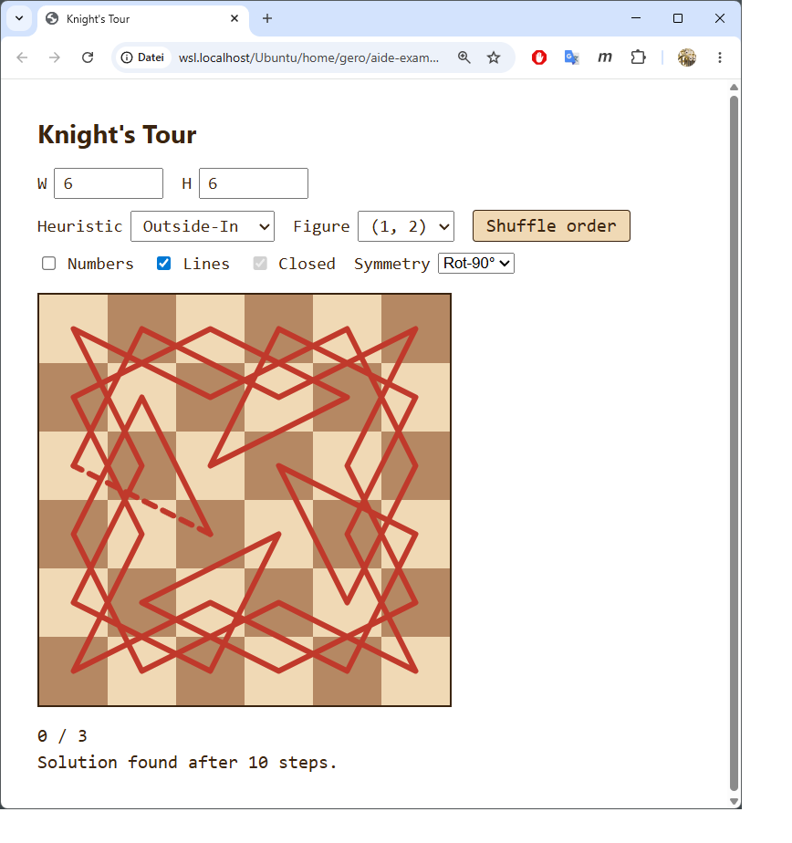

Test-Konfiguration: **6×6 Brett, Knight (1,2), Heuristik Outside-In(!), Symmetrie Rot-90°, Start (0,3)**. Lines an, Numbers aus (Geometrie-Sicht). Solver liefert in **10 Schritten** eine 4-fach rotationssymmetrische geschlossene Tour über alle 36 Felder. Die 4-fache Rotationssymmetrie ist visuell sofort lesbar — die Tour zeichnet eine Windrad-artige geometrische Figur. Die gestrichelte Schließungslinie unten links sichtbar.

Closed-Checkbox erscheint korrekt **disabled+checked** (grauer Rahmen mit Häkchen) — Symmetrie impliziert Closure, UI signalisiert das ohne den User zu verwirren.

Phase-7-Akzeptanzkriterien aus Master-Plan:
- ✓ axisV-Lösung auf passendem Brett sichtbar (6×5, 6×7 etc.)
- ✓ point-Lösung auf 8×8 sichtbar
- ✓ rot90 auf 6×6 sichtbar (und 10×10)
- Auto-Disable für inkompatible Konfigurationen funktioniert

### Commit

`5a17443 — Phase 7: symmetric tours (axisV / point / rot90) via orbit-aware DFS`

---

## Phase 7.5 — T-Contract Erkenntnis & Retrofit

### Der Moment der Erkenntnis

Während Phase 7 (Symmetrien) noch lief und die siebte Phase ohne grobe Probleme durchgezogen wurde, kam der **wichtigste Augenblick der ganzen Übung** in einem User-Halbsatz:

> "Wir kommen fachlich gut voran. Trotzdem hab ich Sorgenfalten im GEsicht. Ahnst du warum?"

Mehrere Vermutungen wurden nacheinander gesammelt (didaktische Tiefe vs. Mischpublikum-Niveau; Code-Aufblähung; `knight.md`-Vorgriff in Phase 7; Zeitbudget) — alle vertretbar, keine richtig. Erst auf Userseite kam das Stichwort:

> "Ich helf dir mit einem Stichwort: NFR"

Und dann die volle Diagnose, die der Master-Plan und ich konsequent übersehen hatten:

> "Unser gesamtes Vorgehen hat einen Designmangel. Wir hätten von Anfang an einen T-Contract (Technical Platform, NFRs) haben sollen und parallel dazu den F-Contract mit der Funktionalität. Ein guter T-Contract hätte replay-fähige Tests gefordert und du hättest daraufhin automatisch (hoffe ich) URL-Args eingeführt, über die zusammen mit CURL eine Automatisierung möglich ist. Wir hätten von Anfang an die i18n-Frage geklärt und Device-Rotation-Fragen und andere Ergonomie-Basics nicht im Rahmen des F-Contracts diskutiert."

Konkret übersehen:
- `knight.md` Z. 18 ("Code soll sehr gut objektorientiert strukturiert sein") wurde als Phase-11-Refactor missinterpretiert → 686 Zeilen monolithische `app.js` mit globalen `let`-Variablen statt einer OO-Architektur ab Tag 1.
- Replay-Testbarkeit via URL-Args: nie eingeführt → kein automatischer Regressionstest möglich.
- i18n: halb-implementiert als feature-artige STRINGS-Map, ohne Switcher, ohne Consolidation.
- Resize/Reflow: nachgereicht in Phase 3 nach User-Hinweis.
- Accessibility: nach sieben Phasen weiterhin null.

Vier Optionen wurden abgewogen, der User wählte **(b) T-Contract retroaktiv + Architektur-Skelett vorziehen**, mit explizitem Phase-12-Eingeständnis. Die Übung gewinnt damit ihr stärkstes "Was Profis anders machen"-Lehrstück.

### Schritt A — T_CONTRACT.md

Eigenes Dokument neben `knight.md` und `knight_plan.md` (Commit `d1f9d60`). Inhalt in 8 Kategorien (Architektur, Plattform-Constraints, Replay-Testbarkeit, Responsivität, i18n, a11y, Performance/Robustheit, Code-Qualität) plus deferred-Liste. Der Header räumt offen ein, dass das Dokument zu spät kommt — diese Ehrlichkeit ist Teil des didaktischen Wertes.

### Schritt B — Retrofit (5 Commits)

| Commit | Inhalt |
|---|---|
| `07d7860` | **B1: OO-Split** der 686-Zeilen-`app.js` in 8 Module unter `js/` (i18n / figures / solver / state / board / renderer / ui / app). Verhalten bit-genau identisch, jede Datei < 250 Zeilen. Erfüllt `knight.md` Z. 18. |
| `ffa89e2` | **B2: URL-Hash-State.** AppState serialisiert den vollständigen Zustand in `location.hash` (W, H, fig, heur, sym, closed, numbers, lines, mix, start). Auf Page-Load wird der Hash geparst; `start=col,row` triggert Auto-Solve. Replay-Test-Mechanismus damit verfügbar: `chrome --headless --screenshot 'index.html#W=6&H=6&fig=1,2&heur=outsideIn&sym=rot90&start=0,3'`. |
| `d4330fe` | **B3: i18n-Vollständigkeit + Sprach-Switcher.** Alle UI-Strings (inkl. Dropdown-Werte) routen via `data-i18n`-Attribute durch I18n. Sprach-Dropdown sichtbar in Reihe 1, persistiert per URL + localStorage. Adding eine Sprache = ein Eintrag in STRINGS. |
| `7ba4c2c` | **B4: a11y-Basics.** `role="grid"` mit `role="gridcell"`, `aria-label "Column C, row R"` (i18n'd), Roving-Tabindex, Pfeil/Home/End/PgUp/PgDn-Navigation, Enter/Space als Klick. `aria-live="polite"` auf Status-Zeilen, `aria-hidden` auf dem SVG-Overlay (decorative). `:focus-visible`-Outlines auf Cells und Controls. |
| `f6f4251` | **B5: Test-Skelett.** `tests/test.html` + `tests/tests.js`: kompakter Browser-Runner (`test`, `assert`, `assertEq`, `validateTour`, `validateClosure`) für die pure Module. 11 Test-Fälle decken `Figures.generateBaseMoves`, `Solver.isSymTypeValid`, `symOrbit`, `symTransform` und `solve` ab — inkl. exakter Schritt-Zahl für 8×8 Warnsdorff (63), Closure-Bridge-Check für 8×8/(3,3) closed, Rotationsinvarianz `path[k+9] = rot90(path[k])` für 6×6 rot90, und der 5×5-Paritäts-Beweis (von hellem Startfeld kein Tour). |

### Schritt D — CLAUDE.md-Prinzip

Neue Sektion in `~/.claude/CLAUDE.md` direkt vor "Baseline-Verhalten ist kein Feature": **"F-Contract und T-Contract gehören gleichzeitig an den Anfang"** — mit Querverweis, der die Baseline-Regel als Spezialfall der breiteren F/T-Regel kenntlich macht. Anti-Pattern explizit benannt: eine Spec-Nebenbemerkung "Code soll OO sein" als gleichwertiges F-Feature behandeln statt als plattform-prägendes T-Item.

### Was nicht retrofitted wurde (transparent in T_CONTRACT.md)

- Touch-Substitut für Rechtsklick → Phase-8-Mikrofrage
- Soft-Step-Limit / Cancel-Dialog → Phase 9
- Cross-Browser-Lauf (Firefox, Safari) → vor Phase 12 manuell
- Farb-Blind-Safe Palette → optional, niedrig
- Mobile-Portrait-Layout → optional, niedrig

### Lehrwert für Phase 12

Dieser Phase-7.5-Block ist der vermutlich **wichtigste einzelne Lehrabschnitt** des ganzen Projekts. Er zeigt nicht nur, *was* der T-Contract ist — sondern auch:

1. Wie er sich in der Praxis als *Nichtgesehenes* zeigt: ein User mit Sorgenfalten, ein AI-Assistent, der vier falsche Vermutungen liefert, bevor das Stichwort vom Menschen kommt.
2. Welche unsichtbaren Kosten anfallen, wenn er fehlt: 686 Zeilen Monolith zu zerschneiden ist teurer als 8 schmale Module von Anfang an zu schreiben.
3. Wie der Retrofit aussieht — und wie er sich öffentlich machen lässt, ohne den ganzen Vorlauf zu verschämen.

Die saubere Trennung F-Contract / T-Contract ist *das* methodische Take-away für AI-Pair-Programming-Praktiker.

### Verifikation Phase-7.5-Akzeptanz

User-Test nach allen 5 B-Commits (siehe Browser-Hardreload):
- ✓ Default 8×8 Knight Warnsdorff identisches Verhalten zur Pre-7.5-Version
- ✓ Phase-7-Demo (6×6 Knight Outside-In Rot-90°) reproduziert die rotationssymmetrische Tour aus `_assets/phase-7-rot90.png`
- ✓ URL-Replay: `index.html#W=6&H=6&fig=1,2&heur=outsideIn&sym=rot90&start=0,3` baut State und löst auto
- ✓ Tab/Pfeil-Keyboard-Navigation auf Brett, Enter/Space löst Solve aus
- ✓ Sprach-Switcher en ↔ de wechselt alle UI-Strings inkl. Dropdown-Werte
- ✓ `tests/test.html` öffnen: alle Assertions grün
- ✓ Modul-Größen: `wc -l js/*.js` zeigt jede Datei < 250 Zeilen

### Commits dieser Phase

```
d1f9d60 — Phase 7.5 A: introduce T_CONTRACT.md
07d7860 — Phase 7.5 B1: split app.js into 8 OO modules
ffa89e2 — Phase 7.5 B2: state via URL hash for replay testability
d4330fe — Phase 7.5 B3: i18n consolidation + visible language switcher
7ba4c2c — Phase 7.5 B4: a11y basics
f6f4251 — Phase 7.5 B5: test skeleton
```
Plus diese PROTOKOLL.md-Ergänzung (Commit C) und ein Eintrag in `~/.claude/CLAUDE.md` (Commit D, außerhalb dieses Repos).

---

## Phase 8 — Blockierbare Felder

### Mikrofragen & Antworten

**Q: Visuelle Darstellung blockierter Felder?**
A: Dunkelgrau (`#4a4a4a`) mit diagonaler Schraffur (`repeating-linear-gradient`). Eindeutig vom Schachfarben-Schema unterscheidbar, klassisches "blocked"-Aussehen. Plus `cursor: not-allowed` als Mikro-Affordance.

**Q: Wie blockiert ein Touch- oder Tastatur-Nutzer ein Feld (T-Contract-Konsequenz: mausspezifische Geste = Substitut nötig)?**
A: Drei Eingabewege auf einen einzigen `onCellBlock`-Handler:
- **Maus:** Rechtsklick (`contextmenu`-Event, Default unterdrückt).
- **Touch:** Long-Press (500 ms `pointerdown` ohne Loslassen). Der anschließende Click wird via `longPressFired`-Flag unterdrückt, damit nicht doppelt getriggert wird.
- **Keyboard:** Shift+Enter / Shift+Space auf fokussierter Zelle.

**Q: Symmetrie + Block-Interaktion?**
A: Auto-Orbit-Erweiterung. Wenn Symmetrie aktiv und User toggelt ein Feld, wird in app.js der gesamte Orbit unter der aktuellen Symmetrie umgeschaltet — 2 Zellen für axisV/point, 4 für rot90. Damit bleibt der Block-Set symmetry-kompatibel.

### Implementation

- **`AppState.blockedCells`** ist ein `Set<string>` von `"col,row"`-Schlüsseln. Persistenz: localStorage als Array + URL-Hash als `block=c1,r1;c2,r2;...`. URL-Eintrag nur wenn nicht-leer (Default-Bereinigungs-Regel von Phase 7.5).
- **Solver `opts.blocked`:** Cells werden vor dem DFS auf `-1` markiert — identisch zur Padding-Bordüre, also keine extra Branch im `pickCandidates`. `total = W*H - |blocked|`; wenn das nicht durch `orbitSize` teilbar ist, bricht der Solver sofort mit `null` ab (z.B. asymmetrischer Block unter aktiver Symmetrie).
- **`Board._wireCellEvents`:** Alle drei Eingabewege in einem privaten Helfer; setzt `pressTimer` für Long-Press, hört auf `contextmenu`, und `longPressFired` blockiert den nachfolgenden Click.
- **`Board.applyBlockClasses()`:** Reflektiert `state.blockedCells` auf die `.blocked`-CSS-Klasse auf allen Zellen. Wird beim Board-Build und nach jedem Toggle aufgerufen.
- **Dimension-Change Pruning:** Wenn der User W oder H verkleinert, werden Blocks außerhalb des neuen Bretts automatisch aus dem Set entfernt.
- **Title-Click Reset:** Räumt zusätzlich auch `blockedCells`.

### Bug-Story: Der hängende Test

Lehrreich genug, um hier festzuhalten — ich hatte als zweiten neuen Test-Fall in `tests/tests.js` geschrieben:

```js
test('Solver: 8x8 knight (0,0) with one blocked cell still solves', () => {
  const r = Solver.solve(8, 8, moves, 0, 0, {
    heuristic: 'warnsdorff',
    blocked: new Set(['4,4']),
  });
  // ...
});
```

Beim Test-Run im Browser hing die Testseite. Node-Probe bestätigte: **Warnsdorff allein auf 8×8 mit einer einzelnen zentralen blockierten Zelle terminiert nicht in 5 Sekunden** — wahrscheinlich nie. Die Heuristik gerät in eine pathologische Backtracking-Region; die normalerweise saubere Springer-Symmetrie der 8×8-Springergraph-Lösungen ist durch das fehlende Zentralfeld zerschnitten.

**User-Hinweis war direkt + nützlich:**
> "Du kannst das Muster nehmen, das ich verwendet habe, die Lösung ist sofort da..."

mit der vollständigen URL als Reproduktions-Recipe (Replay-Test in Action!):
```
…#heur=outsideIn&sym=point&mix=…&start=7,7&block=6,6;1,1;1,6;6,1;3,4;4,3;4,4;3,3
```

Ersetzt durch genau dieses Setting (Outside-In + Point-Symmetrie + 8 symmetrische Blöcke, Start anschließend auf `(0,1)` umgestellt für noch schnelleren Lauf): findet die 56-Zell-geschlossene Tour in 45 Schritten / wenige ms. Lehrwert für Phase 12:

> **Ein Test ist nicht "richtig", nur weil er Code prüft.** Er ist erst dann richtig, wenn er auch *terminiert*. Pathologische Eingaben für Heuristiken finden ist nicht-trivial, und die einfachste Vorsichtsmaßnahme ist: **echte User-Konfigurationen testen, nicht erfundene**. Der User wusste, welcher Block-Stil mit welchen Settings funktioniert — die URL-basierte Replay-Architektur (Phase 7.5 B2) machte es möglich, diese Konfig in einer Zeile vom User-Browser zum Node-Probe zu übertragen.

### Smoke-Tests (Node-Standalone, Stand nach Bugfix)

| Konfig | Ergebnis |
|---|---|
| 8×8 Knight Warnsdorff, kein Block | 63 steps / 2 ms |
| User-Pattern: 8×8 OI Point 8 Blocks (0,1) | found len=56 steps=45 / ms |
| User-Pattern: dito ab (7,7) | found len=56 steps=4209 / ~13 ms |
| Start-Zelle blockiert | `path=null` sofort |
| Asymmetrischer Block unter axisV | `path=null` sofort (`total % orbitSize !== 0`) |

### User-Test

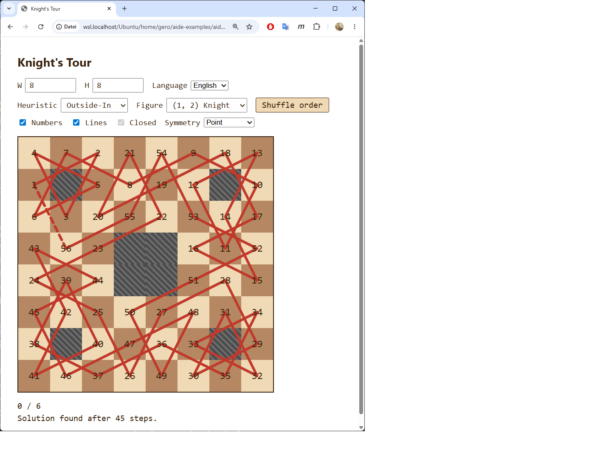

Test-Setup: **8×8, Knight, Outside-In, Point-Symmetrie, 8 blockierte Felder, gemischte Move-Order, Start `(0,6)`**. Die 8 Blöcke bilden ein point-symmetrisches "Maskenmuster" (4 Paare). Lösung erscheint in 45 Schritten — saubere geschlossene Tour über 56 Felder, gestrichelte Schließungslinie sichtbar (oben links).

Bestätigt funktionierende Features:
- ✓ Rechtsklick togglet Block (Browser-Kontextmenü unterdrückt)
- ✓ Auto-Orbit-Erweiterung unter Point: ein Klick → zwei Zellen ändern sich
- ✓ Solver respektiert Blocks; Tour-Länge = 64 - 8 = 56
- ✓ Closing-Linie auch mit Blocks
- ✓ URL-Hash enthält `block=...` (Phase-7.5-Replay-Mechanismus trägt)
- ✓ `tests/test.html` mit 12 Cases läuft komplett grün (nach Bugfix)

### Commits

```
9edead7 — Phase 8: blockable cells via right-click / long-press / Shift+Enter
16523e8 — Phase 8 follow-up: replace hanging Warnsdorff-block test with confirmed user pattern
a9e5df5 — Phase 8 follow-up: faster start cell for the block-pattern test
```

---

## Architektur-Cluster vor Phase 9: DI-Refactor + Sym/SearchDriver-Extraktion

Bevor Phase 9 implementierbar wurde, fielen zwei architektonische Vorklärungen an, die der User direkt angestoßen hat. Beide gehören in die Phase-12-Lehrunterlage, weil sie methodisch ebenso wertvoll sind wie die NFR-Diskussion am Ende von Phase 7.

### Provokante User-Frage: "Welcher Nachteil, wenn wir grundsätzlich mit Instances arbeiten?"

Das System hatte bis dahin den Mischzustand: `I18n` und `AppState` als Singletons (`static getInstance()`), `Solver` als Instance. Der User-Vorschlag war: **alles als Instance**, am Entry-Point genau einmal instanziiert, per Konvention mit `the…` benannt (`const theI18n = new I18n()`).

Antwort nach Abwägung: **fast keine echten Nachteile.** Singleton ist globaler State in Klassen-Hülle und unterläuft `T_CONTRACT.md`-Sektion 1 ("kein globaler State außerhalb von Klassen"). DI macht Abhängigkeiten in jeder Konstruktor-Signatur sichtbar; Tests instanziieren frisch; Embedding mehrerer Boards funktioniert ohne Refactor.

Konsequenzen umgesetzt:
- Neue CLAUDE.md-Sektion **"Dependency Injection bevorzugt vor Singleton-Pattern"** ersetzt die alte "Singleton-Einführung". Globale Wirkung, auch für andere Projekte (User-Bezug: aide-rap).
- `T_CONTRACT.md` Sektion 1 umformuliert: `static getInstance()` ist *nicht* zugelassen.
- Neue `T_CONTRACT.md` Sektion 9 **"Aus dem globalen Coding-Vertrag mitgeerbt"** — listet die CLAUDE.md-Prinzipien, die im Projekt operativ wirken aber aus den projektlokalen Dokumenten allein nicht direkt sichtbar sind (Modulkapselung, Lokalität, Single-Point-of-Access, no-setTimeout-Hack, stille-Auslassung-verboten, Detektor-vor-Fix, only-living-code, MD-Beschreibungssatz). User-Begründung: "ein naiver Leser, der nur Knight's Tour ansieht" muss diese Prinzipien nicht aus Indizien rekonstruieren.
- Code-Refactor: `I18n` und `AppState` haben kein `static getInstance` mehr. Konstruktoren von `AppState`, `Board`, `UI` nehmen ihre Abhängigkeiten explizit. `app.js` ist der einzige Ort, der `new` aufruft.

Commit: `7e485e1` (T_CONTRACT) + `3228758` (Code-Refactor) + manuell `~/.claude/CLAUDE.md`-Update (kein Git-Repo).

### Module über 250 Zeilen → Sym + SearchDriver herausgezogen

`solver.js` lag bei 293 Zeilen, `app.js` bei 283 — Verletzung der T-Contract-Modulgröße. Statt die Regel aufzuweichen wurden zwei klare Schnitte gezogen:

- **`js/sym.js`** — `Sym`-Klasse mit statischen Symmetrie-Helfern (`isValid`, `orbit`, `transform`, `expand`, `SIZES`). Wird von `Solver` und (für Orbit-erweiterte Blocks) von `app.js` benutzt.
- **`js/driver.js`** — `SearchDriver`-Klasse, der Chunked-Async-Executor (50 ms Chunks, Token-Cancellation, Live-Status-Updates). `app.js` instanziiert ihn als `theDriver` und ruft `start(solver)` / `stop()` / `invalidate()`.

Ergebnis (Stand nach Phase 9):

| Datei | Zeilen |
|---|---|
| `js/app.js` | 228 |
| `js/board.js` | 233 |
| `js/driver.js` | 82 |
| `js/figures.js` | 21 |
| `js/i18n.js` | 105 |
| `js/renderer.js` | 69 |
| `js/solver.js` | 238 |
| `js/state.js` | 230 |
| `js/sym.js` | 60 |
| `js/ui.js` | 187 |

Alle unter 250. T-Contract-konform.

---

## Phase 9 — Suchsteuerung: Time-Budget, Stop-Button, Re-Klick = nächste Lösung

### Re-Framing des Master-Plans

`knight.md` Z. 20 hatte vorgeschlagen: "alle 5 Sekunden per `confirm()` fragen, ob weitergesucht werden soll". Der User hat das **mid-Phase neu sortiert** mit der Begründung, dass er *zwei* sehr unterschiedliche Use-Cases hat:

1. **Lange absichtliche Suche.** Beispiel: 10×10 Zebra (2,3) finden, was bis zu 30 Minuten dauern könnte. Hier wäre ein 5-Sekunden-Pop-up unerträglich — der User WILL warten.
2. **Schnelle Exploration.** Beispiel: mehrere Startfelder durchprobieren, nur an denjenigen interessiert die *schnell* eine Lösung liefern. Hier sollte 1-2 Sekunden reichen.

Diese zwei Bedürfnisse werden mit **einem einzigen Mechanismus** bedient: **user-konfiguriertes Zeit-Budget pro Suche**. Default 10 s. User setzt 300 oder 2 je nach Stimmung. Das `knight.md`-5-Sekunden-Confirm-Pattern ist damit obsolet.

### Mikrofragen & Antworten

**Q: Wie soll das Zeit-Budget gesetzt werden?** A: Number-Input "Time budget (s)" in Reihe 1, frei zwischen ≥1, persistiert in URL + localStorage.

**Q: Default-Wert?** A: 10 Sekunden — Mitte zwischen den Use-Cases, deckt fast alle "normalen" Lösungen ab.

**Q: Manueller Stop-Button zusätzlich?** A: Ja, sichtbar während laufender Suche, verschwindet bei Ende.

**Q (vom User vor den Mikrofragen): Re-Klick = "nächste Lösung" — wie soll das genau gehen?** A: Solver-Instanz lebt zwischen Klicks; bei gleichem Startfeld + gleichen Settings setzt die zweite `.search()`-Call die Suche von der vorherigen gefundenen Tour fort (intern: ein Backtrack-Schritt, dann normales Weitermachen). Schritt-Counter wächst über alle Klicks hinweg.

### Implementation (Architektur-Stack)

**1. Solver als echte Instanz mit chunked Execution.**

`Solver.search(maxMs)` läuft die iterative DFS für höchstens `maxMs` Millisekunden, gibt einen Discriminated-Union-Result zurück:

```
{ kind: 'found',     path, steps, closed }   — Tour gefunden
{ kind: 'exhausted', steps }                 — Suchraum leer
{ kind: 'timeout',   steps }                 — Chunk-Zeit erschöpft, resumable
```

Time-Check alle 1000 inneren Iterationen (`CHECK_EVERY`) — `Date.now()`-Overhead ist damit unter 0.1 %.

`Solver.solve(...)` als statischer Wrapper für Tests (übergibt `Infinity` als maxMs).

`foundLast`-Flag: nach `kind: 'found'` macht der nächste `.search()`-Call genau einen Backtrack-Schritt, dann läuft die Schleife normal weiter — die nächste Tour erscheint mit anderer Geometrie. `steps` akkumuliert.

**2. SearchDriver — der chunked Loop in app.js entfernt.**

`new SearchDriver(theState, theI18n, theUI, theRenderer).start(solver)` schedult `setTimeout(0)`-getaktete 50-ms-Chunks. Pro Chunk:

- Token-Check: ein neuer Klick / `stop()` / Settings-Change inkrementiert das interne `token`; veraltete Chunks aussteigen ohne UI zu mutieren.
- `solver.search(min(50ms, remaining))` aufrufen.
- Auf `found` / `exhausted`: Status setzen + ggf. Tour rendern + Stop-Button verstecken.
- Auf `timeout`: Status auf "Searching… N Schritte, T.T s" aktualisieren und nächsten Chunk schedulen.
- Globalbudget-Check: Wenn `elapsed >= theState.timeBudget * 1000`, Abort mit "Aborted after T s, N steps".

**3. AppState.timeBudget** (Sekunden, default 10), persistiert wie alle anderen Felder.

**4. UI:** `time-budget-input` (Number-Input, Reihe 1), `stop-btn` (rotes Button, `hidden`-Attribut steuert Sichtbarkeit). Sprach-Switcher ist davor in Reihe 1.

**5. Solver-Lifecycle in app.js.** Ein einziger `currentSolver` + `currentSolverKey` (Fingerprint aus W, H, col, row, heuristic, figure, mix-order, sym, closed, blocked). Klick mit gleichem Key → Solver-Reuse → `.search()` continued. Settings-Change ruft `dropSolver()`, der den Driver invalidiert und beide auf null setzt → nächster Klick erzeugt frischen Solver.

### i18n (en + de)

Neue Strings: `timeBudgetLabel`, `stopBtn`, `searching(n, sec)`, `aborted(sec, n)`, `stopped(n)`.

### Smoke-Tests (Node-Standalone)

- `Solver.solve(8, 8, ...)` synchron: 64-Zell-Tour in 63 Schritten ✓
- Instanz `.search(Infinity)` zweimal mit Start (3,3): zwei *verschiedene* Touren, Schritt-Counter wächst 63 → 73 ✓
- `.search(20ms)` mit pathologischem `(4,4)`-Block: `timeout` nach ~8000 Schritten ✓

### User-Test (verbal)

Beide Use-Cases vom User bestätigt:
- **Schnelle Exploration:** `timeBudget = 2`, Klick-durch-Startfelder. Browser bleibt während der Suche bedienbar.
- **Lange absichtliche Suche:** großes `timeBudget`, Live-Status zeigt Fortschritt, Stop-Button jederzeit verfügbar, keine Browser-Protector-Pop-ups.
- **Re-Klick = nächste Tour** funktioniert, Schritt-Counter wächst.
- **Settings-Change während Suche:** Suche bricht ab, nächster Klick startet frisch.
- **Tests:** alle 12 Cases grün.

(Kein Screenshot diesmal — die Phase wirkt sich vor allem im *Verhalten* aus, nicht in einem charakteristischen Bild.)

### Commits

```
7e485e1 — T_CONTRACT: DI over Singleton + new section 9 'inherited globals'
3228758 — DI refactor: replace Singleton getInstance with constructor-injected 'theX' convention
0b994e2 — Phase 9: chunked async search with time budget, stop button, re-click-continue
```
Plus `~/.claude/CLAUDE.md`-Sektion "Dependency Injection bevorzugt vor Singleton-Pattern" (außerhalb dieses Repos, ungetrackt).

---

## Phase 10 — Startfeld-Sensitivität

### Mikrofragen & Antworten

**Q: Wie sollen die Sensitivitäts-Werte visuell dargestellt werden?**
A: Heatmap + Zahl. Hintergrundfarbe pro Feld nach log-Skala (grün=schnell, rot=langsam, grau=keine Lösung im Budget); kompakte Schritt-Anzahl als Label im Feld (`63`, `12k`, `1.2M`).

**Q: Was passiert beim Klick auf ein Feld nach einer Sensitivitäts-Anzeige?**
A: Sofort reguläre Tour starten. Heatmap verschwindet, normale Tour wird gerendert.

**Q: Sensitivitäts-Lauf bei aktiver Symmetrie oder Closed-Modus?**
A: Mitnehmen wie aktuelle Settings. Jeder Cell-Lauf nutzt die aktuell konfigurierte Heuristik + Symmetrie + Closed + Blocks.

**Q (während Implementierung): Gilt das Zeit-Budget pro Einzelsuche?**
A: Ja. `state.timeBudget` Sekunden pro Zelle. Bei `budget=2` und 64 Zellen also Worst Case ~2 min Gesamtdauer; Zellen, die schnell lösen, beenden früher und der Scan rückt sofort weiter — typisch viel schneller als Worst Case.

### Implementation

- **`SensitivityScan` in `js/driver.js`** — neue Klasse neben `SearchDriver`. `run()` ist async: iteriert über alle nicht-blockierten Zellen, baut pro Zelle einen frischen `Solver` mit aktuellen Settings, läuft ihn in 50-ms-Chunks bis `'found'`/`'exhausted'` oder bis `state.timeBudget` erreicht. Cooperative yields (`await new Promise(r => setTimeout(r, 0))`) sowohl zwischen Solver-Chunks als auch zwischen Zellen — Browser bleibt responsiv, Stop-Button wirkt sofort. Token-basierte Cancellation wie `SearchDriver`.
- **Heatmap-Rendering in `js/renderer.js`** — `setSensitivityCell(col, row, value, minLog, maxLog)` setzt Background-Color inline + appended ein `.num.sens`-Label. `recolorSensitivity(results, minLog, maxLog)` repaintet alle Zellen, damit der log-Ramp normalisiert bleibt während neue Werte hinzukommen. `_heatColor` ist HSL-basiert (Hue 120 grün → 0 rot). `_compactStepCount` formatiert `1234` → `1234`, `12345` → `12k`, `1234567` → `1.2M`, `null` → `—`.
- **Modul-Hygiene:** Heatmap zog Board ursprünglich über 250 Zeilen → Verlagerung zu Renderer (semantisch sauberer: Board = Zell-DOM/Events; Renderer = paints on cells). Sensitivity-Loop zog `app.js` ebenfalls über 250 → Extraktion als `SensitivityScan` in `driver.js`. Beide Module landen wieder im T-Contract-Rahmen.
- **UI-Wiring:** Sensitivity-Button in `#search-controls` neben Stop, `hidden` per Default. `SearchDriver` zeigt ihn nach `'found'`; `SensitivityScan` zeigt ihn nach Scan-Ende; `onCellClick`/`rebuildBoard` verstecken ihn. Stop-Handler ist *unified*: wenn ein Scan läuft → `theSensitivity.cancel()`; sonst → `theDriver.stop()`.
- **i18n:** drei neue Strings (`sensitivityBtn`, `sensitivityRunning(i, n)`, `sensitivityDone(n)`) für `en` und `de`.

### User-Test

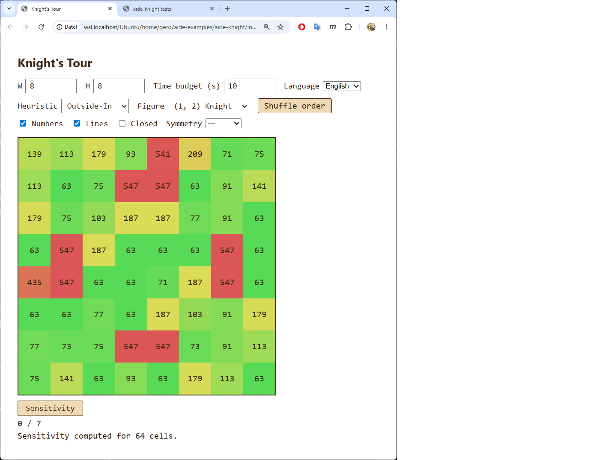

Test-Konfiguration: **8×8 Knight, Heuristik = Outside-In, kein Symmetry/Closed/Block, time budget = 10 s**. Sensitivity-Scan komplettiert alle 64 Felder; Status: "Sensitivity computed for 64 cells."

**Auffällige Datenstruktur:** die Outside-In-Heuristik produziert einen sehr ungleichen Schwierigkeitsteppich:
- Viele grüne Zellen mit `63` Schritten (Outside-In findet hier sauber durch, kein Backtracking)
- Mehrere rote Zellen mit `547` Schritten — ungefähr 8.7-mal mehr als die einfachen Fälle
- Eine Mittelschicht mit Zahlen 73, 75, 91, 113, 139, 179, 187 etc. (gelb-grünes Spektrum)

Vergleich mit Warnsdorff (didaktischer Bonus für Phase 12): Warnsdorff produziert auf 8×8 Knight eine fast einheitliche Landschaft (alle Felder ≈ 63 Schritte). Outside-In zeigt also einen *erheblich* heterogenen Charakter — manche Startfelder sind für Outside-In leicht, andere kosten 8-9× mehr Arbeit. Die Sensitivitäts-Visualisierung macht diesen Unterschied zwischen Heuristiken auf einen Blick erfassbar.

Bestätigt funktionierende Features:
- ✓ Sensitivity-Button erscheint *nach* erster Lösung, vorher hidden
- ✓ Live-Status während Scan zeigt Fortschritt ("cell K/64")
- ✓ Heatmap-Ramp normalisiert sich während der Scan läuft
- ✓ Kompakte Step-Labels passen in die Zellen
- ✓ "0 / 7" Status zeigt: vor dem Sensitivity-Klick war (0, 7) das letzte Startfeld — bleibt erhalten
- ✓ Stop-Button cancelt mid-scan
- ✓ Klick auf eine Heatmap-Zelle nach Scan → Heatmap weg, reguläre Tour erscheint

### Commit

`e7ebf10 — Phase 10: per-cell sensitivity scan with live heatmap`
