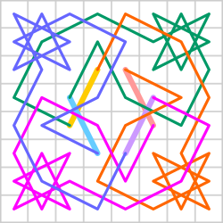

# AIDE - Knight

Find a knight's tour on a chessboard which touches each square once.
 
This project is part of [AIDE examples](https://github.com/aide-examples) - a series of applications built almost completely with agentic coding.

# Background

The search for a path on which a knight visits every square of a chessboard exactly once is a standard problem frequently used in teaching recursion as a programming technique.

Countless solutions exist on the web that solve this problem in various programming languages.

Can Agentic Coding provide added value here? We believe it depends on what the specific learning objective is.

# Initial Assumptions

It is expected that the basics of programming are known — specifically imperative statements, arrays, functions, and parameter passing (by value and by reference).

# The Classical Approach

The task is to program a systematic tree search using recursion to implement pure backtracking. It is then discovered that a 6x6 field is manageable this way, but an 8x8 field requires an additional heuristic, which essentially states: "If you feel constricted, move into the narrow path early". The learning objective is achieved when there is technical proficiency in implementing the recursive search from scratch and in selecting the next move according to this rule.

Typically the students will write three or four functions. Object orientation is considered to be "too complicated for now" and is reserved for "a later stage of maturity" of the students.

When discussing the details of a recursive function the concept of the invocation stack will become clear. It will usually be pointed out that many runtime environments have technical limitations for the call stack due to their "memory models", which can sometimes bring up the necessity for custom stack management within the application itself. Ambitious students will sometimes implement this themselves.

Depending on the language chosen - which will be identical for all students - they will be confronted with dynamic memory management issues or not.

# How Could An AI-supported Approach Work?

In short: It will be less code centric and more problem centric. Motivation will not come from **being able to write correct code** but from **being able to give the correct instructions which will produce fairly good code to solve a problem**. For practitioners and advanced students this is exacly what is needed. For beginners maybe not, but maybe a glimpse of it?

## Step 1

The problem is presented and it is pointed out that humans are not particularly good at systematically playing through all conceivable moves, but machines can do this perfectly if explained precisely how to proceed. The terms "search tree" and "depth first" are introduced, along with a hint that corner squares might be problematic. Question: Is a computer fast enough to try all conceivable move sequences? Approximately how many steps will it take to find a solution?

This is followed by a group discussion in which systematic search and some mechanism to "try good moves first" are recognized as two solution elements that must obviously be combined. This includes guesses about complexity, which should be underpinned by one's own reasoning and then validated through web research. The discussion may also include aspects of CPU clock frequency and the number of cycles which could be necessary to make a single move. The teacher can deepen these points later. The students understand that even a good heuristic will not guarantee short run times and that it does not help at all if the problem has no solution. Thus they focus more on the *character of the problem* than on *how to implement tree search*.

The groups are told to deliver a program with simple DFS (depth first search) and an improved version which is more efficient. The teacher explains that different programming languages may lead to different runtimes for the exact same algorithm and that one of the evaluation criteria will be execution time for large boards. An element of competition often is good for motivation.

## Step 2

Each group asks one or more AI agents to find a program (including source code) on the web or to produce one itself. 
It is the **students' task to formulate a suitable prompt**. They could use the following criteria, for example:

- Functional requirements
  - We are looking for a program which solves the chessboard knight tour problem.
  - It should stop after it has found a solution.
  - We want to measure how efficient the program solves the problem (execution time, maybe other indicators?)
  - The result must be output to the console.
  - The input will happen through the command line.
  - When calling the program, one can specify the size of the playing field (x, y)
  - We need a simple version with pure systematic search first
  - We want to enhance it with our own ideas.
  - OPTIONAL: We know about the Warnsdorff heuristic. Can you also deliver or find a program which uses it?

- Non functional requirements
  - The program should be well-structured and documented.
  - We only accept English code and English comments.
  - The program must be executable locally.

- Steering the search process
  - Look for good candidates in the web and offer the possibility to create such a program yourself
  - Show at least three potential existing candidates and your own solution even if they do not meet all our criteria
  - Produce a ranking table which for external pre-existing solutions containing links to the repective web resources

It is up to the students - and a core part of their learning experience - to create such a prompt. It could be wise not to issue such a prompt as a single transaction. They could also start a discussion with the AI where they explain their intentions before narrowing down their expectations. Ideally they will understand the pros and cons of "make vs. buy". Maybe they also come up with exploring the problem before focusing on "get me a program", hopefully they think of the situation they will face after they have gotten their "code present" ...

- "Give me a good conceptual paper on the *Knight's Tour Problem* which explains systematic search and ideas for improvement." The response may point to an article like this one: https://medium.com/@danielfrost_3076/implementing-a-heuristic-solution-to-the-knights-tour-problem-513a73cc7e20
- "Given I ask you to create the program yourself - will you then be especially good at explaining how it works?"
- "Or can you do the same kind of analysis and explanation for any program we would choose from the other candidates?"
- I want to minimize runtime and I will try to optimize the search algorithm later".

Maybe a clever discussion with the AI will bring up the following aspects:
- The development of good search strategies and their optimized implementation can be decoupled.
- We can start with a type-free scripting language and have the AI translate our code later to C++ once we are finished
- If we find an optimized version in the web (or have the AI produce one initially) the code my be harder to understand. Do we like this greater challenge? Finally we may end up with a low level language like C or with a complex object oriented language like C++ anyway. Isn't it better to take that path from the very beginning?
- It is important to have a precise measure for the *quality of our algorithm*. Besides the absolute execution time we should show the number of trials needed to solve the problem.
- More complex algorithms will need more execution time per step, however, so we should also calculate the average time needed for a single search step.
- Will we have two programs in the end or can it be one program where we can switch the improvement heuristic on and off?

All these considerations deal with WHAT and WHY more than with HOW?

## Step 3

One or more candidates are installed by each group, executed and tested. Then their code will be examined for 5 minutes (300 seconds, indeed), perhaps adding a few comments or highlighting some statements on a printed copy of the source code.

Maybe some groups start work with a collection of functions while others found a solution using a class design. Further extending the programs will inevitably bring up the **need to switch to object oriented design**. It is important that the teacher introduces the basic idea of OO now or during the early next steps. *Just function and data being perceived as a logical unit.* Nothing else.

## Step 4

Now the groups exchange their experiences and get feed-back from the teacher. Then the actual work begins, with most changes to the programs being executed by agents.

---

To illustrate potential artefacts created during step #4 you will find **a collection of Python scripts in this repository**.
The *HTML file* was produced by version 8 of the scripts. The *Python scripts* also contain information about the *prompt* used to create the script. The two *markdown files* show responses of an AI agent (in this case: Chat GPT) during an important design step.

---

- We start asking the AI to **Explain** how the systematic tree search works. 

- Where is the place in the code which identifies promising moves? How are they ordered? Is the ordering step "stable" regarding the initial sequence of the possible moves which were detected?

- Then we **run the program** for a really large board (80x80 instead of 8x8). Programs working with direct recursion will encounter difficulties with stack limits here. Affected student groups will have to look for a solution. 
  - They can do this in a naive way ("I want to solve really large boards")
  - Or they ask for **re-engineering** of their current code with explicit stack handling.
  - Inspecting those changes at code level should be done. Results of the initial and the improved version must be compared for smaller board sizes. If the students are using a highly integrated agent UI (like VS Code and Claude code) they may be able to delegate the testing completely to the agent. 

- Now we think about the **Warnsdorff heuristic**. The sequence in which squares with equal rank are tried might play a role. Usully moves are detected in circular order. Does the execution time change if a different (but always the same) order is used?

- We observe our way of changing the program: Obviously it is a bad strategy to create a new program via copy/paste to make these changes. Simply changing the current version and letting *git* do the boring part is also not so good (why?). Therefore we introduce command line options to enable/disable the new features.

- We **test more hypotheses**, e.g. Could it be advantageous to proceed from the outside in — i.e., "When moves are of equal value, always choose the one that leads us closer to the edge of the playing field."

- What about the **starting point** in the top left corner? Can it be advantageous to start exactly one move away from that field? Or is it more promising to start in the center?

- Most probably the **growing number of command line options** will raise the desire to handle them cleanly and explain them to the user. So we might issue a prompt like "Our programm needs professional handling of command line options and explanations of what the user can do".

- The next step could be a teacher input about a typical way of **micro-optimisation**: The simple piece of code that tests whether a target field is inside or outside the board must obviously test four conditions! This can be avoided if we surround the board with *two stripes of blocked fields*. It makes most sense to use such strategies in combination with a language like C. But it will also help in scripting environments. Let us try out and measure the performance gain using the DFS algorithm. Some students could try to implement this manually but we would not require all of them to do it that way. maybe they could receive "extra points" for doing it without AI.

- The next step is an obligatory manual change for all groups: **AI is on holiday.** You must add a new option which enforces **closed tours**. Why this one? Because you need to make a small series of changes at different locations in the code. Will the students understand that a closed tour on a 7x7 board is absolutely impossible? Will they integrate a check and a response to the user for odd board sizes?

- The next one is also a manual step but more on conceptual level: If we wanted to find a **symmetric tour**: Would we implement it in the same way, i.e. checking at the end of the tour if it is symmetric? Why is this a really bad idea? What could work better? How about starting with two or four squares simultaneously (deending on the type of symmetry we want) and forcefully mirroring a move made on the first path to the other paths? How do we handle moves which connect path chunks? This is really an interesting task for students with "some mental energy left over". We will probably see different speeds between the groups and we should accept them.

- We ask for a **graphical visualisation of the results**. Several technical alternatives like producing animated gifs or using specialized tools for graph visualisation should be discussed in the group and with AI agents. In our case the AI went for complicated and platform dependant solutions until we pointed it directly at the possibility of generating HTML with SVG and some Javascript for animation. When asked to compare the alternatives it preferred our suggestion and "proved" its superiority. Let us be extremely suspicious of such **tendencies of AI agents to "please their users"**! Whatever you choose, you will almost certainly think: "AI should do this job and I don't bother a bit how it produces the graph and what the code looks like that it uses for that purpose. I will give my feed-back based on the outcome and hopefully I can steer the AI precisely enough to produce what I have in mind. In our case Claude Code (Anthropic) did a good job and it took less that 20 minutes to arrive at a good looking HTML with animation features.

- Further steps could be to introduce **blocked squares** — an even number of squares (half black, the other half white! Why?) which cannot be touched by the knight. We store a few arrangements of such squares in the code and allow these examples to be selected via the command line. Maybe we also should offer to specify blocked squares via the command line...

- If we use specific arrangements of blocked squares (like blocking one of the two entry points for each corner square) a human will easily see that a solution is definitely impossible because we have four dead ends. Our program might instead burn hours of CPU in such a case. Can we add an ability to **identify non solvable problems**? At least for this kind of non-feasable boards?

- Finally the outlook: If we have very large playing areas (1,000 x 1,000, for example), it should be possible to work with **tiling**! Research shows that others have done this before us. We develop our own thoughts on the "building blocks" which we would need for tiling and then look for sources on how this (certainly non-trivial) problem was solved. We accept that it is **beyond our possibilities** to re-invent that wheel.

## Step 5

Document your experiences in a paper of five pages. *First* collect everything you want to say in a list of bullet items. *Only afterwards* ask the AI to create a similar text on its own "about the experiences we made together, about the problem itself and about the solution we finally created". Then ask the AI to integrate your items into its text while not going beyond five pages. Are you happy with the result? Is it "yours"?
How different is it from what the other groups produced?

---

# Sample Scripts

As said before, we offer sample scripts, mark down files and the HTML produced to illustrate possible results of an AI centric approach.
Expect that your groups will find their own path through te jungle of possibilities. We do not offer a result for step #5.
You may want to apply some quality metrics to the scripts and to the document produced in step #5, however.

# Summary

Through the use of agents, the understanding of the application domain gains dominance over the technical implementation. This becomes particularly clear when switching from the recursively programmed version to a self-managed stack of the move history.
Given a fixed amount of time for teachers and learners, one must decide whether this kind of change to a program is a core goal of the education or whether it is sufficient to know that "there can be technical problems with recursion and tree search, but they can somehow be solved".

**There will be no universal answer to this.** Some computer scientists must be able to deal with all flavours of recursiveness; many others will never design or maintain a system in their professional lives in which recursion occurs. Some must design highly optimized core algorithms which require a thorough understanding of pointers, of explicit allocation and disposal of dynamic memory. Gladly most software engineers can rely on garbage collection nowadays.

---

Agentic coding can enhance the complexity of a program rapidly. Sometimes this leads to new hemispheres that would not have been touched by the traditional approach of teaching: In our example the students could learn how command line options are handled professionally. The AI will probably introduce a library for this. So the students will understand the usefulness of relying on "building blocks" instead of hand coding improvised command line parsing. Introducing agentic coding will allow talented students to explore complex enhancements like symmetry while others struggle with the basics. This is a challenge for the teacher - and it is his reward for arranging a group-centric competetive learning experience for the students.

Taken to the extreme, one could apply the principle of "inverted classroom". In that approach the lesson would start with each group **already having gone through steps 1, 2 and 3 on their own**. Step 3 (code reading) could use more time in that approach.
The first minutes of step #4 would be used to exchange experiences in a structured way, focusing on 
- the **sequence and quality of AI prompts** issued
- the **quality of suggestions received** (depending on the skill level of the students!)
  - Were the programs easy to install?
  - Did the programs work correctly?
  - Do we see global variables?
  - Do we only have a bunch of functions or did we get an object oriented system?
  - How much code duplication did the AI introduce when asked to add the Warnsdorff rule?
  - Is inheritance a good approach to separate different algorithms?
  - Do we see "if (algo=='xx') .. " at many places in the code?
  - How about passing functions as parameters? What is dependency injection?
  - How about discussing such architectural issues with the AI?
- the **degree of confidence** the groups have in their chosen solution for further extension

Then the **common work could start with step 4**. Yes, this will be a hard time for the teacher. Better have two or three of them for six groups working simultaneously.

---

Continously working with agentic coding improves the skill of formulating wishes, ideas, defining requests, reporting errors, considering enhancements, demanding suggestions and explanations, documenting the outcome and looking critically at the produced artifacts. *As stated before we think this is an important aspect for IT education.*