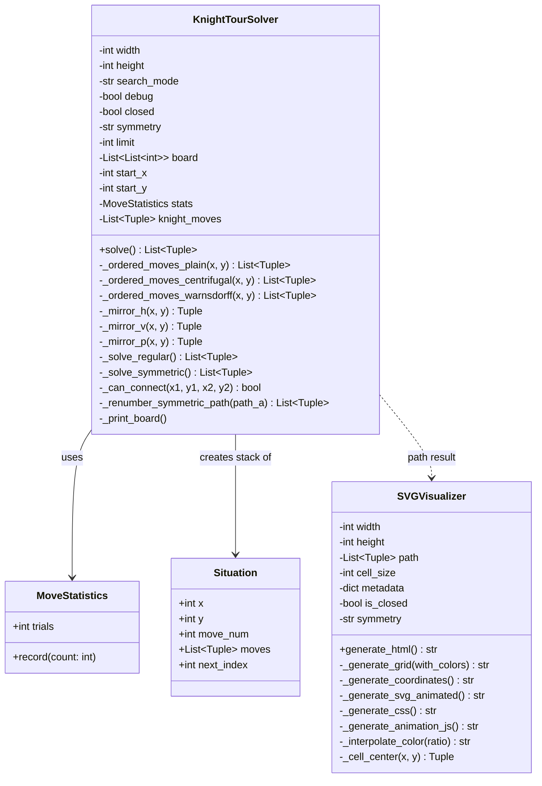

# Knight-09-Symmetry - Program Structure

A knight's tour solver with support for symmetric tours (vertical, horizontal, point symmetry).

## Architecture Overview

The program uses an iterative DFS approach with an explicit stack to avoid recursion limits. A sentinel board eliminates bounds checking. Three search strategies are available: plain DFS, centrifugal (prefer edges), and Warnsdorff (prefer narrow paths).



## Key Components

### MoveStatistics
Counts move examinations for performance analysis.

### Situation (Dataclass)
Stack frame for the iterative DFS:
- `x, y`: Current position
- `move_num`: Current move number
- `moves`: List of valid moves from this position
- `next_index`: Index of next move to try

### KnightTourSolver
Main solver with two algorithms:
- **`_solve_regular()`**: Standard DFS for open/closed tours
- **`_solve_symmetric()`**: Uses mirror-blocking approach - when placing a move, its mirror is blocked with `MIRROR_BLOCKED = -3`

### SVGVisualizer
Generates interactive HTML visualization with:
- Animation controls (play/pause, step, speed)
- Full Tour button (clean static view)
- Color/number toggles

## Board Representation

```
+--+--+--+--+--+--+--+--+--+
|BB|BB|BB|BB|BB|BB|BB|BB|BB|  BB = BLOCKED (-2)
+--+--+--+--+--+--+--+--+--+
|BB|BB|BB|BB|BB|BB|BB|BB|BB|  Sentinel padding: +4 width, +4 height
+--+--+--+--+--+--+--+--+--+  Offset: +2 for actual board coordinates
|BB|BB|  |  |  |  |  |BB|BB|
+--+--+--+--+--+--+--+--+--+  EMPTY = -1
|BB|BB|  |  |  |  |  |BB|BB|  Move numbers: 0, 1, 2, ...
+--+--+--+--+--+--+--+--+--+  MIRROR_BLOCKED = -3 (symmetric mode)
|BB|BB|  |  |  |  |  |BB|BB|
+--+--+--+--+--+--+--+--+--+
|BB|BB|BB|BB|BB|BB|BB|BB|BB|
+--+--+--+--+--+--+--+--+--+
|BB|BB|BB|BB|BB|BB|BB|BB|BB|
+--+--+--+--+--+--+--+--+--+
```

## Symmetric Tour Algorithm

1. Place move at `(x, y)`, mark with move number
2. Calculate mirror position, mark with `MIRROR_BLOCKED`
3. Continue DFS until half the board is covered
4. Check if current position connects to mirror of start
5. If yes: reconstruct full path by mirroring path A to get path B
6. Symmetric tours are always closed (A-end connects to B-start via symmetry)

## Usage

```bash
# Basic tour
python3 knight-09-symmetry.py 8 8

# With visualization
python3 knight-09-symmetry.py 8 8 -v

# Symmetric tour (vertical)
python3 knight-09-symmetry.py 6 6 --symmetry=v -v

# Warnsdorff heuristic
python3 knight-09-symmetry.py 8 8 --warnsdorff -v
```
